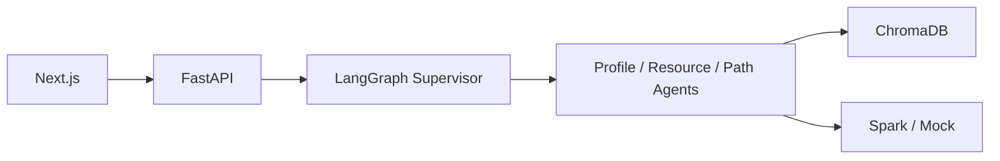

# 学径 · LearnPath

> 基于 **LangGraph 多智能体 + 课程知识库 RAG + 讯飞星火** 的个性化学习资源生成系统
>
> 第十五届「中国软件杯」**A3 赛题**参赛作品

    

赛题全文：[A3赛题内容.md](./A3赛题内容.md) · 官方页面：[cnsoftbei.com](https://www.cnsoftbei.com/content-3-1286-1.html)

---

## 目录

- [功能概览](#功能概览)
- [技术栈](#技术栈)
- [快速开始](#快速开始)
- [体验流程](#体验流程)
- [仓库结构](#仓库结构)
- [环境变量](#环境变量)
- [前端路由](#前端路由)
- [后端 API](#后端-api)
- [多智能体角色](#多智能体角色)
- [常见问题](#常见问题)
- [文档索引](#文档索引)
- [赛题与合规](#赛题与合规)

---

## 功能概览

| 模块 | 说明 |
|------|------|
| **对话式学习画像** | 自然语言一轮对话提取 6+ 维学情，随学随更新 |
| **多模态资源生成** | 讲解文档、思维导图（Mermaid）、习题、拓展阅读、多模态脚本、代码案例 |
| **学习路径规划** | 依据画像与资源库生成有序学习步骤 |
| **智能辅导** | 基于 RAG 的知识库问答（TutorAgent） |
| **学习效果评估** | 评估报告与可视化图表（EvalAgent） |
| **防幻觉与安全** | RAG 来源引用、敏感词过滤、一致性检查 |

**前端亮点**

- 登录页静默预加载所有页面 JS chunk + ECharts，进度条实时反馈
- 登录后初始化进度条跟踪 API 请求（profile / resources / path），全部就绪后才进入主界面
- Keep-alive 路由：页面首次挂载后永不卸载，切换仅修改 CSS `display`，响应即时

默认课程知识库：**机器学习导论**（`data/knowledge_base/ml_intro`）。无星火 API Key 时保持 `LLM_MOCK=true` 即可本地演示。

---

## 技术栈

| 层级 | 技术 |
|------|------|
| 后端 API | FastAPI + Uvicorn |
| 多智能体编排 | LangGraph（Supervisor + 专项 Agent） |
| 大模型 | 讯飞星火 HTTP（OpenAI 兼容），支持 Mock |
| 知识检索 | ChromaDB + 课程 Markdown 分块入库 |
| 持久化 | SQLite（`storage/learnpath.db`） |
| 前端框架 | Next.js 14 App Router |
| UI 组件 | Ant Design 5 |
| 图表 | ECharts（懒加载 + 模块缓存） |
| 状态管理 | Zustand |

---

## 快速开始

### 环境要求

- Python 3.11+（3.10 可运行）
- Node.js 20+
- 可选：讯飞星火 API Key

### 1. 配置环境变量

```powershell
# Windows
Copy-Item .env.example .env
Copy-Item frontend\.env.local.example frontend\.env.local
```

```bash
# Linux / macOS
cp .env.example .env
cp frontend/.env.local.example frontend/.env.local
```

编辑 `.env`：无密钥时保持 `LLM_MOCK=true`；接入星火时填写 `SPARK_API_KEY` 并设 `LLM_MOCK=false`。

### 2. 启动后端

```powershell
# Windows
cd backend
python -m venv .venv
.\.venv\Scripts\Activate.ps1
pip install -r requirements.txt
cd ..
.\backend\.venv\Scripts\python scripts\ingest_kb.py   # 知识库入库
cd backend
uvicorn app.main:app --reload --host 0.0.0.0 --port 8000
```

```bash
# Linux / macOS
cd backend && python3 -m venv .venv && source .venv/bin/activate
pip install -r requirements.txt && cd ..
./backend/.venv/bin/python scripts/ingest_kb.py
cd backend && uvicorn app.main:app --reload --host 0.0.0.0 --port 8000
```

验证：<http://localhost:8000/api/health>（健康检查）· <http://localhost:8000/docs>（Swagger）

### 3. 启动前端

```bash
cd frontend
npm install
npm run dev
```

浏览器访问 <http://localhost:3000>，进入登录页后点击「**开始学习**」即可（默认填写了演示用户名与课程）。

### 4. 一键启动（Windows）

```powershell
.\scripts\dev.ps1    # 同时启动后端 + 前端（新窗口）
.\scripts\open.ps1   # 打开 entry.html 入口页
```

或双击根目录 **`打开学径.bat`** 打开本地入口导航页。Linux/macOS 使用 `scripts/dev.sh`。

---

## 体验流程

1. 打开 <http://localhost:3000>，登录页加载完毕后点击「**开始学习**」
2. 进入主界面，等待初始化进度条（约 2–5 秒，视网络状态）
3. 在 **智能对话（/chat）** 发送：
   > 「我是计算机专业，想学习机器学习导论，线性回归比较薄弱」
4. 切换至 **学习画像（/profile）** 查看雷达图与六维卡片
5. 在 **资源库（/resources）** 点击「生成新资源」
6. 在 **学习路径（/path）** 点击「重新规划」生成学习步骤

---

## 仓库结构

```
A3/
├── backend/
│   └── app/
│       ├── agents/          # LangGraph 编排（graph.py、supervisor.py）与各 Agent 节点
│       ├── api/             # REST / SSE 路由（chat、profile、path、resources、tutor）
│       ├── core/            # 配置、LLM 客户端、guardrails
│       ├── rag/             # 分块入库（ingest.py）与检索（retriever.py）
│       ├── services/        # 业务层：调用 graph，处理流式/非流式响应
│       └── db/              # SQLAlchemy 模型与仓储
├── frontend/
│   └── src/
│       ├── app/             # Next.js 页面（chat | profile | path | resources | evaluation）
│       ├── components/
│       │   ├── AppShell.tsx      # 侧边栏 + Keep-alive 内容区 + 初始化进度遮罩
│       │   ├── LoginContent.tsx  # 全屏登录页（含 chunk 预加载进度条）
│       │   └── pages/            # 各页面内容组件（code-split）
│       ├── lib/             # API 封装、ECharts hook、resourceConfig
│       └── store/           # Zustand 全局状态（auth + 业务数据）
├── data/knowledge_base/     # 课程原始 Markdown（可自行扩充）
├── docs/                    # 需求规格、开发指南、开源协议等
├── scripts/                 # 知识库入库（ingest_kb.py）、本地联调启动脚本
├── storage/                 # 运行时 DB / Chroma（gitignore）
├── .env.example
└── A3赛题内容.md
```

---

## 环境变量

| 变量 | 说明 | 默认值 |
|------|------|--------|
| `LLM_MOCK` | 无星火密钥时使用 Mock LLM | `true` |
| `SPARK_API_KEY` | 讯飞星火 API Key | 空 |
| `SPARK_BASE_URL` | OpenAI 兼容 Base URL | `https://spark-api-open.xf-yun.com/v1` |
| `SPARK_MODEL` | 模型 ID | `generalv3.5` |
| `DATABASE_URL` | SQLite 路径 | `./storage/learnpath.db` |
| `CHROMA_PERSIST_DIR` | 向量库目录 | `./storage/chroma` |
| `KNOWLEDGE_BASE_DIR` | 课程文档目录 | `./data/knowledge_base/ml_intro` |
| `CORS_ORIGINS` | 允许的前端来源（逗号分隔） | `http://localhost:3000` |
| `NEXT_PUBLIC_API_BASE` | 前端请求的后端地址（`frontend/.env.local`） | `http://localhost:8000` |

---

## 前端路由

| 路径 | 功能 |
|------|------|
| `/` | 重定向至 `/chat` |
| `/chat` | 智能对话，SSE 流式输出，快捷提问 |
| `/profile` | 学习画像雷达图与六维卡片 |
| `/resources` | 资源库列表、按类型筛选、Markdown 预览 |
| `/path` | 学习路径总进度与分阶段展开 |
| `/evaluation` | 学习评估仪表盘 |

未登录时所有路由均展示登录页（由 `AppShell` 统一拦截）。

---

## 后端 API

| 方法 | 路径 | 说明 |
|------|------|------|
| GET | `/api/health` | 健康检查 |
| POST | `/api/chat` | 对话（JSON 响应） |
| POST | `/api/chat/stream` | 对话（SSE 流式） |
| GET | `/api/profile/{user_id}` | 获取学习画像 |
| POST | `/api/resources/generate` | 触发多类资源生成 |
| GET | `/api/resources` | 资源列表（`?user_id=`） |
| GET | `/api/path/{user_id}` | 获取学习路径 |
| POST | `/api/path/{user_id}/refresh` | 重新规划路径 |
| POST | `/api/tutor/ask` | 辅导问答 |

完整交互式文档：<http://localhost:8000/docs>

---

## 多智能体角色

| Agent | 职责 |
|-------|------|
| **Supervisor** | 意图识别，路由至下游节点 |
| **ProfileAgent** | 对话抽取 / 更新学习画像 |
| **DocAgent** | 讲解文档生成 |
| **MindmapAgent** | 思维导图（Mermaid） |
| **QuizAgent** | 练习题 |
| **ReadingAgent** | 拓展阅读 |
| **MediaAgent** | 多模态讲解 / 分镜脚本 |
| **CodeAgent** | 代码实操案例 |
| **PathAgent** | 学习路径规划 |
| **TutorAgent** | 智能辅导（加分项） |
| **EvalAgent** | 学习效果评估（加分项） |



---

## 常见问题

**没有星火 API Key 能运行吗？**  
可以。`.env` 中保持 `LLM_MOCK=true`，对话与资源生成返回 Mock 结构化内容，前端完整可用。

**前端提示无法连接后端？**  
确认后端已启动；检查 `frontend/.env.local` 中 `NEXT_PUBLIC_API_BASE=http://localhost:8000`；若前端运行在非 3000 端口，将该端口加入 `.env` 的 `CORS_ORIGINS`。

**知识库检索无结果？**  
执行 `.\backend\.venv\Scripts\python scripts\ingest_kb.py`（使用 venv 内的 Python），确认 `data/knowledge_base/ml_intro/chapters/` 下存在 Markdown 章节文件。

**访问画像 / 资源返回空数据？**  
需先在 `/chat` 完成至少一轮对话以构建画像，资源生成依赖画像数据。

**前端报 `Cannot find module './vendor-chunks/...'`？**  
`.next` 缓存损坏，执行：

```powershell
.\scripts\clean-frontend.ps1  # 或手动：Remove-Item -Recurse -Force frontend\.next
cd frontend && npm run dev
```

---

## 文档索引

| 文档 | 内容 |
|------|------|
| [docs/01-需求规格说明书.md](./docs/01-需求规格说明书.md) | 功能 / 非功能需求与验收标准 |
| [docs/02-开发指南.md](./docs/02-开发指南.md) | Agent 扩展、RAG 流程、API 细节 |
| [docs/03-开源参考与协议.md](./docs/03-开源参考与协议.md) | 参考项目与依赖许可证 |
| [docs/04-系统开发说明书-提纲.md](./docs/04-系统开发说明书-提纲.md) | 初赛配套文档骨架 |
| [A3赛题内容.md](./A3赛题内容.md) | 赛题全文、评分占比、提交要求 |

讯飞星火接入：[HTTP 接口文档](https://www.xfyun.cn/doc/spark/HTTP%E8%B0%83%E7%94%A8%E6%96%87%E6%A1%A3.html)

---

## 赛题与合规

- 赛题编号：**A3** — 基于大模型的个性化资源生成与学习多智能体系统开发
- 出题企业：科大讯飞股份有限公司 · 答疑 QQ 群：1072584310
- 开源组件与讯飞服务使用须遵守 [docs/03-开源参考与协议.md](./docs/03-开源参考与协议.md)
- 参赛作品著作权归参赛团队所有

