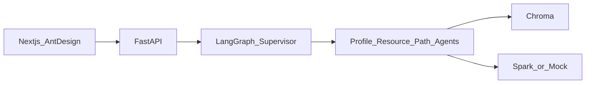

# 学径（LearnPath）

基于 **LangGraph 多智能体**、**课程知识库 RAG** 与 **讯飞星火** 的个性化学习资源生成系统 —— 第十五届「中国软件杯」A3 赛题作品。

`Python` · `FastAPI` · `LangGraph` · `Next.js` · `Ant Design` · `Chroma`

赛题全文见 [A3赛题内容.md](./A3赛题内容.md)，官方页面：[A组赛题](https://www.cnsoftbei.com/content-3-1286-1.html)

---

## 快速入口（点击打开）

> 需先启动后端与前端（见下方「快速开始」）。服务运行后点击下方链接即可。

| 入口 | 说明 |
|------|------|
| [**打开前端 · 智能对话**](http://localhost:3000/chat) | 默认端口 3000 |
| [打开前端 · 备用 3001](http://localhost:3001/chat) | 3000 被占用时使用 |
| [后端 API 文档](http://localhost:8000/docs) | Swagger |
| [健康检查](http://localhost:8000/api/health) | 确认后端已启动 |

**本地启动页（推荐）**：双击项目根目录下的 [`打开学径.bat`](./打开学径.bat)，或在资源管理器中打开 [`entry.html`](./entry.html)，在页面中点击按钮进入各模块。

PowerShell 一键打开浏览器：`.\scripts\open.ps1`

---

## 核心能力

| 能力 | 说明 | 代码 / 页面 |
|------|------|-------------|
| 对话式学习画像 | 自然语言构建 6+ 维画像，随学随新 | `ProfileAgent` · `/profile` |
| 多模态资源生成 | 讲解文档、思维导图、习题、拓展阅读、多模态说明、代码案例 | 六个 Resource Agent · `/resources` |
| 学习路径规划 | 按画像与资源生成有序学习步骤 | `PathAgent` · `/path` |
| 智能辅导 | 基于 RAG 的答疑（框架已接入） | `TutorAgent` · `/chat` |
| 学习效果评估 | 评估报告与图表（前端为演示数据，待接 API） | `EvalAgent` · `/evaluation` |
| 防幻觉与安全 | RAG 引用、敏感词过滤、一致性检查占位 | `backend/app/rag/` · `guardrails.py` |

默认课程知识库：**机器学习导论**（`data/knowledge_base/ml_intro`）。无星火 API Key 时可使用 `LLM_MOCK=true` 本地演示。

---

## 技术栈

| 层级 | 技术 |
|------|------|
| 后端 API | FastAPI、Uvicorn |
| 多智能体 | LangGraph（Supervisor + 专项 Agent） |
| 大模型 | 讯飞星火 HTTP（OpenAI 兼容），支持 Mock |
| 检索 | ChromaDB + 课程 Markdown |
| 持久化 | SQLite（`storage/learnpath.db`） |
| 前端 | Next.js 14、Ant Design 5、ECharts、Zustand |
| 文档 | 见 [docs/](./docs/) |

---

## 快速开始

### 环境要求

- Python 3.11+（3.10 可运行）
- Node.js 20+
- 可选：讯飞星火 API Key（见 `.env`）

### 1. 配置环境变量

在项目根目录执行：

```powershell
# Windows PowerShell
Copy-Item .env.example .env
Copy-Item frontend\.env.local.example frontend\.env.local
```

```bash
# Linux / macOS
cp .env.example .env
cp frontend/.env.local.example frontend/.env.local
```

编辑 `.env`：无密钥时保持 `LLM_MOCK=true`；接入星火时填写 `SPARK_API_KEY` 并设 `LLM_MOCK=false`。

若前端运行在 **3001** 等非默认端口，请在 `.env` 中将 `CORS_ORIGINS` 设为 `http://localhost:3000,http://localhost:3001`。

### 2. 启动后端

```powershell
cd backend
python -m venv .venv
.\.venv\Scripts\Activate.ps1          # Windows
# source .venv/bin/activate           # Linux / macOS
pip install -r requirements.txt
cd ..
.\backend\.venv\Scripts\python scripts\ingest_kb.py   # Windows 使用 venv 内 Python
# backend/.venv/bin/python scripts/ingest_kb.py       # Linux / macOS
cd backend
uvicorn app.main:app --reload --host 0.0.0.0 --port 8000
```

```bash
cd backend && python3 -m venv .venv && source .venv/bin/activate
pip install -r requirements.txt && cd ..
./backend/.venv/bin/python scripts/ingest_kb.py
cd backend && uvicorn app.main:app --reload --host 0.0.0.0 --port 8000
```

验证：

- 健康检查：<http://localhost:8000/api/health>
- Swagger：<http://localhost:8000/docs>

### 3. 启动前端

新开终端：

```bash
cd frontend
npm install
npm run dev
```

浏览器访问 <http://localhost:3000>（若 3000 被占用，终端会提示实际端口，如 3001）。

### 4. 一键启动并打开（Windows）

已配置好后端 venv 时，可在项目根目录执行：

```powershell
.\scripts\dev.ps1    # 启动后端 + 前端（新窗口）
.\scripts\open.ps1   # 打开 entry.html 与可用前端地址
```

或直接双击 **`打开学径.bat`** 打开本地入口页（需服务已启动）。

Linux/macOS 可使用 `scripts/dev.sh`，浏览器访问 <http://localhost:3000/chat>。

### 5. 建议体验流程

1. 打开 `/chat`，发送「我是计算机专业，想学习机器学习导论，线性回归比较薄弱」
2. 打开 `/profile` 查看画像雷达图
3. 在 `/resources` 点击「生成新资源」
4. 在 `/path` 点击「重新规划」生成学习路径

---

## 环境变量（常用）

| 变量 | 说明 | 默认 |
|------|------|------|
| `LLM_MOCK` | 无星火密钥时使用 Mock LLM | `true` |
| `SPARK_API_KEY` | 讯飞星火 API Key | 空 |
| `SPARK_BASE_URL` | OpenAI 兼容 Base URL | `https://spark-api-open.xf-yun.com/v1` |
| `SPARK_MODEL` | 模型 ID | `generalv3.5` |
| `DATABASE_URL` | SQLite 路径 | `./storage/learnpath.db` |
| `CHROMA_PERSIST_DIR` | 向量库目录 | `./storage/chroma` |
| `KNOWLEDGE_BASE_DIR` | 课程文档目录 | `./data/knowledge_base/ml_intro` |
| `CORS_ORIGINS` | 允许的前端来源（逗号分隔） | `http://localhost:3000` |
| `NEXT_PUBLIC_API_BASE` | 前端请求的后端地址（`frontend/.env.local`） | `http://localhost:8000` |

完整说明见 [docs/02-开发指南.md](./docs/02-开发指南.md)。

---

## 仓库结构

```
A3/
├── backend/
│   └── app/
│       ├── agents/          # LangGraph 编排与各 Agent 节点
│       ├── api/             # REST / SSE 路由
│       ├── core/            # 配置、LLM、guardrails
│       ├── rag/             # 分块、入库、检索
│       ├── services/        # 业务层调用 graph
│       └── db/              # ORM 与仓储
├── frontend/
│   └── src/
│       ├── app/             # 页面：chat | profile | path | resources | evaluation
│       ├── components/      # AppShell、AntdProvider
│       ├── lib/             # API 封装
│       └── store/           # Zustand 全局状态
├── data/knowledge_base/     # 课程原始 Markdown（需自行扩充）
├── docs/                    # 需求、开发指南、开源协议等
├── scripts/                 # ingest_kb.py、dev.ps1 / dev.sh
├── storage/                 # 运行时 DB / Chroma / 生成物（gitignore）
├── .env.example
└── A3赛题内容.md
```

| 目录 | 职责 |
|------|------|
| `backend/app/agents` | 多智能体协同核心（赛题实现重点） |
| `backend/app/rag` | 课程知识 grounding，支撑防幻觉 |
| `frontend/src/app` | Ant Design 五页 UI，流式对话与图表 |
| `data/knowledge_base` | 赛题要求的 ≥1 门完整课程文档输入 |
| `docs` | 需求规格、开发说明书提纲、协议声明 |
| `scripts` | 知识库入库与本地联调启动 |
| `storage` | 本地运行产物，不提交 Git |

---

## 架构示意



详细图源文件：[docs/diagrams/architecture.mmd](./docs/diagrams/architecture.mmd)

---

## 前端路由

| 路径 | 功能 |
|------|------|
| `/` | 重定向至 `/chat` |
| `/chat` | 智能对话，SSE 流式输出，快捷提问 |
| `/profile` | 学习画像雷达图与六维卡片 |
| `/resources` | 资源库列表、按类型筛选、Markdown 预览 |
| `/path` | 学习路径总进度与分阶段展开 |
| `/evaluation` | 学习评估仪表盘（当前为演示数据） |

侧栏布局见 `frontend/src/components/AppShell.tsx`。

---

## 后端 API 速查

| 方法 | 路径 | 说明 |
|------|------|------|
| GET | `/api/health` | 健康检查 |
| POST | `/api/chat` | 对话（JSON 响应） |
| POST | `/api/chat/stream` | 对话（SSE 流式） |
| GET | `/api/profile/{user_id}` | 获取学习画像 |
| POST | `/api/resources/generate` | 触发多类资源生成 |
| GET | `/api/resources?user_id=` | 资源列表 |
| GET | `/api/path/{user_id}` | 获取学习路径 |
| POST | `/api/path/{user_id}/refresh` | 重新规划路径 |
| POST | `/api/tutor/ask` | 辅导问答 |

交互式文档：<http://localhost:8000/docs>（服务启动后访问）。

---

## 多智能体角色

| Agent | 职责 |
|-------|------|
| Supervisor | 意图识别，路由至下游节点 |
| ProfileAgent | 对话抽取/更新学习画像 |
| DocAgent | 讲解文档 |
| MindmapAgent | 思维导图（Mermaid） |
| QuizAgent | 练习题 |
| ReadingAgent | 拓展阅读 |
| MediaAgent | 多模态讲解 / 分镜脚本 |
| CodeAgent | 代码实操案例 |
| PathAgent | 学习路径规划 |
| TutorAgent | 智能辅导（加分项） |
| EvalAgent | 学习效果评估（加分项） |

---

## 常见问题

**没有星火 API Key 能运行吗？**  
可以。`.env` 中保持 `LLM_MOCK=true`，对话与资源生成返回 Mock 结构化内容。

**前端提示连接失败？**  
确认后端已启动；检查 `frontend/.env.local` 中 `NEXT_PUBLIC_API_BASE=http://localhost:8000`；若前端端口为 3001，同步修改根目录 `.env` 的 `CORS_ORIGINS`。

**知识库检索无结果？**  
在项目根目录执行 `python scripts/ingest_kb.py`（建议使用 `backend/.venv` 内的 Python），并确认 `data/knowledge_base/ml_intro/chapters/` 下有 Markdown 章节。

**访问 `/api/profile/demo` 返回 404？**  
需先在 `/chat` 完成至少一轮对话以构建画像。

**端口 3000 已被占用？**  
Next.js 会自动改用 3001 等端口，以终端输出为准，并更新 `CORS_ORIGINS`。

**前端报 `Cannot find module './vendor-chunks/@rc-component.js'`？**  
多为 `.next` 缓存损坏。先关闭所有 `npm run dev` 窗口，再执行：

```powershell
Remove-Item -Recurse -Force frontend\.next
cd frontend
npm run build
npm run dev
```

或运行 `.\scripts\clean-frontend.ps1`。

---

## 文档索引

| 文档 | 内容 |
|------|------|
| [docs/01-需求规格说明书.md](./docs/01-需求规格说明书.md) | 功能/非功能需求与验收标准 |
| [docs/02-开发指南.md](./docs/02-开发指南.md) | Agent 扩展、RAG 流程、API 细节 |
| [docs/03-开源参考与协议.md](./docs/03-开源参考与协议.md) | 参考项目与依赖许可证 |
| [docs/04-系统开发说明书-提纲.md](./docs/04-系统开发说明书-提纲.md) | 初赛配套文档骨架 |
| [A3赛题内容.md](./A3赛题内容.md) | 赛题全文、评分占比、提交要求 |

讯飞星火接入：[HTTP 接口文档](https://www.xfyun.cn/doc/spark/HTTP%E8%B0%83%E7%94%A8%E6%96%87%E6%A1%A3.html)

---

## 开发路线图

| 阶段 | 状态 | 目标 |
|------|------|------|
| Sprint 0 | 已完成 | 框架、文档、样例知识库、Mock/SSE、Ant Design UI |
| Sprint 1 | 待做 | 画像 JSON 解析强化、随学随新 |
| Sprint 2 | 待做 | 资源生成质量、RAG、生成进度 UI |
| Sprint 3 | 待做 | 路径算法与资源推送 |
| Sprint 4 | 待做 | 辅导/评估 API、Reviewer 防幻觉 |
| Sprint 5 | 待做 | 测试说明书、7 分钟演示视频、初赛材料 |

---

## 赛题与合规

- 赛题编号：**A3** — 基于大模型的个性化资源生成与学习多智能体系统开发  
- 出题企业：科大讯飞股份有限公司 · 答疑 QQ 群：1072584310  
- 开源组件与讯飞服务使用须遵守 [docs/03-开源参考与协议.md](./docs/03-开源参考与协议.md)  
- 参赛作品著作权归参赛团队所有；商业合作事宜见 [A3赛题内容.md](./A3赛题内容.md) 文末说明
