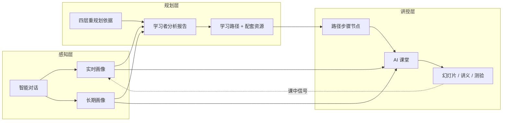
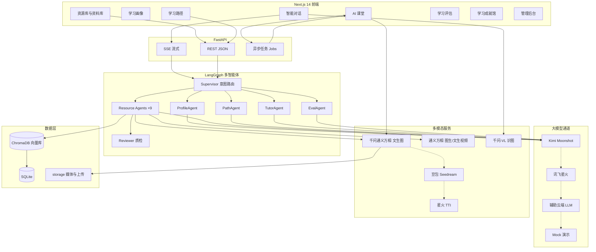

# 学径 · LearnPath

> 基于 **LangGraph 多智能体 + 课程知识库 RAG + 多通道大模型** 的个性化学习资源生成与 AI 教学系统
>
> 第十五届「中国软件杯」**A3 赛题**参赛作品 · 在赛题基线能力之上持续演进的产品化版本

    

赛题全文：[A3赛题内容.md](./A3赛题内容.md) · 官方页面：[cnsoftbei.com](https://www.cnsoftbei.com/content-3-1286-1.html)

---

## 目录

- [项目简介](#项目简介)
- [能力全景：赛题基线 vs 当前增强](#能力全景赛题基线-vs-当前增强)
- [核心功能详解](#核心功能详解)
- [路径重规划 × 实时画像 × AI 课堂（核心闭环）](#路径重规划--实时画像--ai-课堂核心闭环)
- [技术架构](#技术架构)
- [技术栈](#技术栈)
- [快速开始](#快速开始)
- [推荐体验路径](#推荐体验路径)
- [仓库结构](#仓库结构)
- [环境变量](#环境变量)
- [前端路由](#前端路由)
- [后端 API 一览](#后端-api-一览)
- [多智能体与 LLM 路由](#多智能体与-llm-路由)
- [多模态 AI 配图与视频](#多模态-ai-配图与视频)
- [常见问题](#常见问题)
- [文档索引](#文档索引)
- [赛题与合规](#赛题与合规)

---

## 项目简介

**学径（LearnPath）** 面向高校自学与课程辅导场景，把「对话建画像 → 多类型资源生成 → 学习路径规划 → 课堂讲授 → 效果评估」串成一条可闭环的学习链路。系统不内置本地大模型权重，通过 OpenAI 兼容 HTTP 调用 **Kimi / 讯飞星火 / 辅助云端模型**，并可选用 **阿里云百炼（千问通义万相）**、**火山方舟（豆包 Seedream）** 等能力增强多模态体验。

与赛题提交版相比，当前仓库在保持 A3 核心验收项完整可用的前提下，新增了 **AI 课堂、课程资料库、实时学情、个性化策略层、多会话对话、附件理解、学习成就馆、平台管理后台** 等一整套产品化能力，更适合长期迭代与答辩演示。

默认内置课程知识库：

| 资料库 ID | 名称 | 说明 |
|-----------|------|------|
| `builtin-ml-intro` | 机器学习导论 | 回归、分类、评估、梯度下降等章节 |
| `builtin-python-basics` | Python 程序设计基础 | 语法、数据结构、函数、OOP 等章节 |

---

## 能力全景：赛题基线 vs 当前增强

### 赛题基线能力（均已保留）

| 模块 | 说明 |
|------|------|
| **对话式学习画像** | 自然语言一轮对话提取 **7 维学情**（专业、基础、薄弱点、风格、节奏等），随学随更新 |
| **多智能体资源生成** | LangGraph Supervisor 调度 Doc / Mindmap / Quiz / Reading / Media / Code 等 Agent |
| **学习路径规划** | 依据画像与资源库生成有序步骤，支持步骤状态 PATCH |
| **智能辅导** | 基于 RAG 知识库问答（TutorAgent） |
| **学习效果评估** | 测验提交、统计图表、评估建议（EvalAgent） |
| **防幻觉与安全** | RAG 来源引用、敏感词过滤、一致性检查、Reviewer 质检 |
| **学习行为闭环** | 浏览/完成埋点、对话历史、推荐推送 |

### 当前版本新增 / 显著增强

| 类别 | 增强点 | 价值 |
|------|--------|------|
| **大模型** | **Kimi（Moonshot）优先路由**；对话多通道失败自动降级；深度思考 / 联网检索 | 生产可用性更强，演示不依赖单一厂商 |
| **画像** | **长期画像 + 实时学情**双视图；困惑度、投入度、认知负荷等动态指标；**个性化策略层**驱动回复风格 | AI 不只「记住你是谁」，还能感知「你现在怎样」 |
| **资源** | 资源类型从 6 类扩展到 **9 类**（+课件提纲 / 设计方案 / 实践项目）；**完整套件**一键生成 | 覆盖赛题「完整套件」与课件类交付物 |
| **资料库** | **用户上传资料库**（PDF/DOCX/PPTX/XLSX/代码等）；**全网检索整理**模式；双内置课程 | 真正支持「自建知识库输入」与无课件时的兜底 |
| **AI 课堂** | 路径节点内嵌课堂；三步向导；**异步生成任务**；幻灯片 + **AI 教学配图**；互动测验；**PPTX 导出**；课堂库收藏/重生成 | 把「规划」落到「可讲授的课堂」 |
| **多模态** | **千问通义万相**文生图 / 图生视频；豆包 Seedream；星火 TTI；**千问-VL** 聊天识图；SVG 回退 | 讲解资源与课堂插图真正「看得见」 |
| **智能对话** | **多会话管理**；图片/文件**附件上传**；删除单轮回复；流式阶段提示（思考中 / 联网中） | 接近主流 AI 助手的产品体验 |
| **学习路径** | **异步重规划任务**；重规划时可选择资料库或全网模式；路径步骤一键进入课堂 | 长任务不阻塞 UI |
| **成就与账号** | **学习成就馆**（独立视觉页）；邮箱 OTP 登录；个人主页资料编辑 | 留存感与真实账号体系 |
| **运维** | **平台管理后台**（用户/资源/活动看板）；Demo 数据重置；健康检查暴露 LLM / 多模态状态 | 便于答辩运维与批量演示 |

---

## 核心功能详解

### 1. 智能对话 `/chat`

- **SSE 流式输出**，Markdown 渲染，快捷提问模板
- **多会话侧边栏**：按日期分组，新建 / 切换 / 删除会话
- **深度思考**：在画像、辅导、路径等 Prompt 末尾追加推理约束
- **联网思考**：无本地资料时由 LLM 规划检索并整理摘要（`web_research_service`）
- **附件**：上传图片（千问-VL 理解）与文档（文本抽取），随消息送入上下文
- **多通道降级**：Kimi → 辅助模型 → 星火 → Mock 依次尝试
- 对话后自动刷新**长期画像**与**实时学情**到全局 Store

### 2. 学习画像 `/profile`

- **长期画像**：雷达图 + 六维/七维卡片（专业、基础水平、薄弱点、学习风格等）
- **实时学情**：情绪、投入度、认知负荷、困惑主题、好奇主题等本轮状态
- 支持手动刷新分析、查看学习信号时间线
- 画像数据驱动资源推荐、路径重规划、课堂个性化策略

### 3. 资源库 `/resources`

两个 Tab：**学习资源**（已生成成品）与 **课程资料库**（原始课件）。

**生成依据三选一：**

1. **依据已有资料库** — RAG 检索 + 可选 LLM 补充
2. **新建资料库** — 上传文件 → 单文件分析 → 库级合成 → 向量入库 → 再生成
3. **无资料库 · 全网检索** — LLM 规划检索主题并整理可信摘要后生成

**资源类型（9 类）：**

| 类型 | 说明 |
|------|------|
| `doc` | 讲解文档 |
| `mindmap` | 思维导图（Mermaid） |
| `quiz` | 练习题 |
| `reading` | 拓展阅读 |
| `media` | 多模态讲解（分镜 + AI 配图/视频 + SVG 回退） |
| `code` | 代码实操案例 |
| `ppt` | 课件提纲 |
| `design` | 教学设计方案 |
| `project` | 实践项目任务书 |

生成过程通过 **SSE 进度流**展示阶段（上下文准备 → 各类型 Agent → 质检）。支持单资源重生成、下载、收藏、清除未收藏项。

### 4. 学习路径 `/path` 与 AI 课堂 `/classroom`

路径规划、实时学情感知与 AI 课堂讲授是本版本的**核心差异化能力**，三者构成「规划 → 感知 → 讲授」闭环。完整设计、数据流与演示步骤见专章：[路径重规划 × 实时画像 × AI 课堂](#路径重规划--实时画像--ai-课堂核心闭环)。

### 5. 学习评估 `/evaluation`

- 提交测验答案，更新掌握度统计
- ECharts 可视化：正确率、题型分布、时间线
- EvalAgent 生成学习建议，反哺画像与路径

### 6. 学习成就馆 `/insights`

从个人主页进入的**独立视觉页**（非侧栏常驻项）：

- 学习天数、连续打卡、资源完成、路径进度等成就指标
- 聊天活跃度、评估表现、资源类型分布图表
- 「游戏化」呈现学习历程，适合答辩演示留存数据

### 7. 个人主页与设置

- `/account`：昵称、邮箱、专业、简介、课程等资料编辑；入口跳转成就馆
- `/settings`：深色/浅色主题、流式速度、深度思考默认开关、语音偏好等

### 8. 平台管理后台 `/admin`

管理员 Token 登录后进入独立 Shell：

| 页面 | 功能 |
|------|------|
| `/admin` | 总览看板、14 日活跃、用户排行 |
| `/admin/users` | 用户列表、删除、Demo 数据重置 |
| `/admin/resources` | 全平台资源概览 |
| `/admin/activity` | 30 日活跃曲线、最近学习事件 |

### 9. 前端工程体验

- 登录页 **静默预加载** 全部页面 chunk + ECharts
- 登录后 **初始化进度遮罩**：并行拉取 profile / resources / path / eval 并预热各页
- **Keep-alive 路由**：页面首次挂载后不卸载，切换仅改 `display`，切页无白屏
- 独立页（课堂 / 成就馆）带专属加载转场

---

## 路径重规划 × 实时画像 × AI 课堂（核心闭环）

> 这是相对赛题原版最大的产品化增强：**学习路径不是静态清单，而是会随你的对话与当下状态重新规划；每个路径节点都能一键进入个性化 AI 课堂。**

### 1. 设计理念：两层画像 + 一条路径 + 课堂执行

学径把「学生是谁」拆成两个时间尺度，再用路径和课堂串起来：

| 层次 | 名称 | 回答的问题 | 主要数据来源 | 主要消费场景 |
|------|------|------------|--------------|--------------|
| **长期** | 学习画像（Profile） | 你是谁、基础怎样、长期薄弱点、学习风格 | 多轮对话抽取、行为刷新 | 路径规划、资源推荐、课堂长期偏好 |
| **短期** | 实时画像（Realtime） | 你现在卡在哪、累不累、好奇什么 | 每条用户消息规则分析 + 深度思考 LLM 增强 | 对话语气、课堂讲法、重规划时的分析报告 |
| **执行** | 学习路径（Path） | 先学什么、再学什么、每步配什么资源 | 画像分析报告 + 四层重规划依据 | 步骤进度、配套资源、**AI 课堂入口** |
| **落地** | AI 课堂（Classroom） | 这一步怎么讲、怎么练、怎么检查 | 长期画像 + **实时画像** + 路径节点 + 关联资源 | 幻灯片、讲义、随堂测、PPTX |


```mermaid
flowchart LR
  subgraph sense [感知层]
    Chat[智能对话]
    RT[实时画像]
    LT[长期画像]
  end

  subgraph plan [规划层]
    Ctx[四层重规划依据]
    Analysis[学习者分析报告]
    Path[学习路径 + 配套资源]
  end

  subgraph teach [讲授层]
    Step[路径步骤节点]
    Room[AI 课堂]
    PPT[幻灯片 / 讲义 / 测验]
  end

  Chat --> RT
  Chat --> LT
  RT --> Analysis
  LT --> Analysis
  Ctx --> Analysis
  Analysis --> Path
  Path --> Step
  RT --> Room
  LT --> Room
  Step --> Room
  Room --> PPT
  PPT -.课中信号.-> RT
```

**关键原则：**

- 实时画像**不替代**长期画像，只描述「这一轮」；课堂和对话都会同时读取两者。
- AI 课堂**挂在路径步骤上**（`step_key` 绑定），不是与路径无关的独立功能。
- 重规划会**清空旧路径并按阶段重生资源**，但用户**收藏的资源会保留**在资源库中。

---

### 2. 实时画像：系统如何感知「你此刻的状态」

#### 2.1 包含哪些维度

`RealtimeLearningState` 持久化在 SQLite，典型字段：

| 字段 | 含义 | 示例 |
|------|------|------|
| `emotion` | 显性情绪标签 | confused / frustrated / excited / tired … |
| `implicit_emotion` | 自然语言情绪描述 | 「有点焦虑但还想继续」 |
| `engagement` | 投入度 | low / medium / high |
| `confusion_level` | 困惑度 0–1 | 连问「什么意思」时升高 |
| `curiosity_level` | 好奇度 0–1 | 追问「为什么」时升高 |
| `cognitive_load_level` | 认知负荷 0–1 | 提到公式太多、抽象时升高 |
| `stuck_topics` | 卡点主题 | 「梯度下降」「损失函数」 |
| `curiosity_topics` | 好奇主题 | 「正则化」「特征工程」 |
| `preferred_reply_style` | 偏好的讲解方式 | 「结构化说明，配合例子」 |
| `next_best_action` | 建议的下一步教学动作 | 「先给直觉再举最小例题」 |
| `evidence` | 判断依据（内部） | 「出现困惑或卡住表达」 |

前端在 **学习画像 `/profile`** 提供「长期画像 / 实时学情」Tab 切换；实时页展示情绪摘要、仪表盘（困惑/好奇/负荷等）以及卡点/好奇主题芯片。

#### 2.2 何时更新

每次用户在 **智能对话** 发送消息时，后端 `analyze_realtime_state()` 会：

1. 读取最近 12 条聊天记录与上一轮实时状态；
2. 用**规则引擎**分析措辞（「不懂」「太难」「为什么」「累了」等）更新情绪与数值指标；
3. 若开启**深度思考**，再调用主 LLM 做增强分析；
4. 写入数据库，供后续课堂 / 重规划 / 对话策略使用。

删除聊天记录时，系统会调用 `invalidate_chat_derived_state()`，清理无证据支撑的 `stuck_topics` / `curiosity_topics`，避免「空聊天却显示卡点」。

#### 2.3 如何影响教学（用户不可见的策略层）

实时画像不直接展示给课堂里的学生看，而是经 **`personalization_strategy_service`** 转成内部 Prompt：

- `build_personalization_strategy(profile, realtime_state, question_type="classroom")` 综合长期 + 短期，选出教学模式（如 unblock / simplify / explore / challenge …）；
- `format_realtime_reply_policy_prompt()` 把困惑度、负荷、信心等转成**硬性讲法约束**（例如困惑 ≥ 0.62 时：「先降压 → 一句直觉 → 最多 3 步拆解」）。

同一套机制也用于智能对话与辅导，保证**全站语气一致**。

---

### 3. 路径重规划：六步后台任务与四层依据

#### 3.1 入口与交互（`/path`）

1. 点击「**重新规划学习路径**」打开配置弹窗；
2. 可选填写**学习目标**（删光聊天后建议手填）；
3. 选择配套资源来源：**全网检索** 或 **指定课程资料库**；
4. 弹窗实时调用 `GET /api/profile/{user_id}/replan-context` 预览本次规划依据；
5. 确认后提交 `POST /api/path/{user_id}/replan-jobs`，前端轮询 Job 进度。

重规划进行中，路径页显示全屏进度；可切到其他页面，浮窗继续展示任务状态。

#### 3.2 四层规划依据（软拦截）

`replan_context_service` 在启动 Job 前汇总四类信号，**至少满足一层**才允许 `can_start=true`：

| 层级 | 代号 | 内容 | 典型来源 |
|------|------|------|----------|
| **L1 意图** | `has_l1_intent` | 学习目标、对话轮次、诉求摘要 | 当前会话消息、画像中的 `learning_goal`、用户手填目标 |
| **L2 锚点** | `has_l2_anchor` | 收藏资源、选定资料库 | `starred_resource_ids`、重规划弹窗所选 `library_id` |
| **L3 行为** | `has_l3_behavior` | 浏览/完成次数、最近测验 | 资源 view/complete 事件、eval 记录 |
| **分析层** | Step 3 | 学习者综合分析报告 | 长期画像 + **实时画像** + 行为信号（LLM 生成） |

学习目标解析优先级：

```
用户手填 goal → 画像 learning_goal → 对话主题 → 收藏资源标题 → 资料库名称
```

若三层均为空，返回 `block_reason`：「请先对话说明学习目标，或选择资料库 / 保留收藏资源后再重规划」。

#### 3.3 六步服务端流水线

`path_replan_job_service` 在后台顺序执行：

| 步骤 | 标签 | 做什么 |
|------|------|--------|
| **0** | 清除当前规划 | 删除旧 `learning_path` 与步骤进度 |
| **1** | 清除资源库 | 删除**未收藏**的学习资源（收藏保留） |
| **2** | 分析画像 | `analyze_learner_profile()`：综合长期画像 + **实时状态** + 聊天/测验/浏览 → 持久化分析报告 |
| **3** | 重新规划路线 | `replan_learning_path()`：`quality_replan=true` + `deep_thinking=true`，PathAgent 双轮质检 |
| **4** | 重新生成配套资源 | 按每个**主阶段**调用资源管线（资料库 RAG 或全网模式） |
| **5** | 最终确认 | 校验路径与资源引用完整性，修复断链并落库 |

Step 3 子阶段（前端 `sub_phases` 可见）：

读取学习者画像分析 → 提取目标与薄弱点 → 规划主阶段 → 设计子步骤 → 质检优化 → 写入新路径

Step 4 会按阶段标题逐个生成 doc/quiz/mindmap 等，并把 `resource_ids` 写回对应路径步骤——**这是「进入课堂」时可选的关联资源来源**。

#### 3.4 高质量规划参数

与赛题基础「刷新路径」不同，当前重规划默认开启：

- `quality_replan=True`：更低温度、更严 Prompt、双轮 `collect_plan_quality_issues` 质检；
- `deep_thinking=True`：规划 Prompt 使用深度思考版本；
- 用户请求由 `build_replan_user_request(context)` 自动拼装（目标 + 对话摘要 + 收藏 + 资料库 + 测验行为）。

---

### 4. AI 课堂：路径节点的个性化讲授

#### 4.1 与路径的绑定关系

每个路径步骤（含子步骤）在 UI 上带有 **AI 课堂** 按钮，四态逻辑：

| 状态 | 按钮文案 | 含义 |
|------|----------|------|
| `idle` | AI 课堂 | 该步骤尚未生成过课堂 |
| `generating` | 生成中… | 后台 Job 运行中（可浮窗查看） |
| `ready` | 进入课堂 | 课堂库已有 `step_key` 匹配且 `status=done` |
| `error` | 生成失败 | 可重试或查看日志 |

从路径点击时，前端构造 `ClassroomSessionSeed`：

```ts
{
  stepKey,           // 与路径步骤 id 一致
  title,             // 步骤标题
  objective,         // 步骤学习目标
  resourceIds,     // 重规划时挂到该步的资源 id 列表
  estimatedMinutes,
  courseName,
  source: "path"    // 标记来自路径入口
}
```

若课堂库已有同 `step_key` 的完成记录，**直接进入**已生成课堂，无需重新排队。

#### 4.2 课前向导（`/classroom` 三步）

| 步骤 | 用户配置 | 系统用途 |
|------|----------|----------|
| 1 | 确认步骤主题、关联资源 | 作为 `classroom_step` 与 `selected_resources` 注入 LLM |
| 2 | 教学模式 + 深度层级 + 关键词 | 控制例题数量、推导深度、练习难度 |
| 3 | 本地文件上传（可选） | 解析摘要写入 `local_materials`，优先体现在幻灯片与讲义 |

提交后创建 `POST /api/classroom/session/jobs`，九阶段进度与路径重规划类似（整理材料 → 读画像 → … → 生成配图）。

#### 4.3 生成时如何用到画像

`generate_classroom_session()` 核心输入：

```python
profile = await get_profile(user_id)           # 长期画像
realtime = await get_realtime_state(user_id)   # 实时画像
path_step = _path_step_context(path, step_key) # 路径节点上下文
strategy = build_personalization_strategy(
    profile=profile,
    realtime_state=realtime,
    question_type="classroom",
)
personalization_brief = (
    format_personalization_strategy_prompt(strategy)
    + format_realtime_reply_policy_prompt(strategy, realtime)
)
```

LLM 收到的 JSON Payload 同时包含：

- `long_term_profile` — 专业、薄弱点、风格、节奏等；
- `realtime_profile` — 当下情绪、卡点、好奇点、负荷；
- `personalization_strategy_for_ai_only` — **禁止展示给学生**的内部讲法契约；
- `classroom_step` — 来自路径的标题/目标/预估时长；
- `selected_resources` / `local_materials` — 重规划挂载的资源与上传材料。

因此：**同一路径步骤，在不同时间进入课堂，若你刚在对话里表达了「听不懂」，新生成的课堂会更倾向慢速拆解、多例子、少公式。**

#### 4.4 课堂产出物

| 产出 | 说明 |
|------|------|
| `slides` | 8–18 页中文幻灯片，含 layout / visual_blocks（表格、流程、例题结构） |
| `handout` | 6–10 节课后复习讲义 |
| `teacher_scripts` | normal / confused / slow / example / practice 五套讲稿 |
| `check_question` | 当堂检查题 |
| `homework` | 3–6 个轻量课后任务 |
| `image_url`（每页可选） | 千问/豆包 AI 教学配图（失败则跳过，不阻断课堂） |

课中点击 **听不懂 / 讲慢点 / 换个例子 / 来道题 / 已掌握**，前端切换到 `teacher_scripts` 对应模式——与实时画像识别的「卡点」形成呼应，并可在后续对话中继续更新实时状态。

#### 4.5 课堂库与 PPTX

- 每次生成写入 **课堂库**（`GET /api/classroom/library`），按 `step_key` 索引；
- 支持收藏、删除、**一键重生成**（保留原请求参数）；
- `POST /api/classroom/session/export-pptx` 导出可编辑 `.pptx`。

---

### 5. 三者联动：推荐完整演示流程

以下流程适合答辩或自测，约 **20–25 分钟**，能完整展示「感知 → 重规划 → 课堂」：

```
① 智能对话（建立双层画像）
   「我是计算机大二，想学机器学习导论，线性回归和梯度下降很薄弱，公式一看就晕」
   → 长期画像写入薄弱点；实时画像 elevated confusion + stuck_topics

② 学习画像页
   切换到「实时学情」→ 确认困惑度、卡点主题已出现

③ 学习路径 → 重新规划
   弹窗选手填目标或沿用对话主题；选择「机器学习导论」资料库
   观察 replan-context 预览：intent_summary / starred_count / can_start
   提交后等待六步 Job（可去聊天页继续提问，实时画像会持续更新）

④ 路径生成完成
   展开某一主阶段子步骤 → 查看已关联资源数量
   点击「AI 课堂」→ 向导中选「慢速拆解 + 标准掌握」→ 等待课堂 Job

⑤ 进入课堂
   放映幻灯片；点击「听不懂」看讲稿切换；生成随堂测验
   导出 PPTX

⑥ 回到对话
   「刚才损失函数那块还是不太懂」→ 实时困惑度再次升高

⑦ 对该步骤「重新生成课堂」或进入下一步
   新课堂应更贴近最新实时状态（更慢、更多例子）
```

---

### 6. 关键 API 速查

| 场景 | 方法 | 路径 |
|------|------|------|
| 读取实时画像 | GET | `/api/profile/{user_id}/realtime` |
| 预览重规划依据 | GET | `/api/profile/{user_id}/replan-context?conversation_id=&learning_goal=&library_id=` |
| 提交重规划 Job | POST | `/api/path/{user_id}/replan-jobs` |
| 轮询重规划进度 | GET | `/api/path/replan-jobs/{job_id}` |
| 更新步骤状态 | PATCH | `/api/path/{user_id}/steps/{step_key}` |
| 创建课堂 Job | POST | `/api/classroom/session/jobs` |
| 轮询课堂进度 | GET | `/api/classroom/session/jobs/{job_id}` |
| 课堂库列表 | GET | `/api/classroom/library` |
| 导出 PPTX | POST | `/api/classroom/session/export-pptx` |

---

### 7. 实现文件索引（便于二次开发）

| 模块 | 后端 | 前端 |
|------|------|------|
| 实时画像 | `services/realtime_state_service.py` | `components/pages/ProfileContent.tsx` |
| 个性化策略 | `services/personalization_strategy_service.py` | — |
| 重规划依据 | `services/replan_context_service.py` | `PathContent.tsx`（弹窗 + context 预览） |
| 重规划 Job | `services/path_replan_job_service.py` | `hooks/usePathReplanJob.ts` |
| 路径规划 Agent | `agents/nodes/path_agent.py` | — |
| 画像分析报告 | `services/profile_analysis_service.py` | — |
| 课堂生成 | `services/classroom_service.py` | `components/pages/ClassroomContent.tsx` |
| 课堂 Job | `services/classroom_job_service.py` | `lib/classroomActive.ts` |
| 路径进课堂 | — | `PathContent.tsx` → `useStartClassroom.tsx` |

---

## 技术架构


```mermaid
flowchart TB
  subgraph UI [Next.js 14 前端]
    Chat[智能对话]
    Profile[学习画像]
    Res[资源库与资料库]
    Path[学习路径]
    Class[AI 课堂]
    Eval[学习评估]
    Insights[学习成就馆]
    Admin[管理后台]
  end

  subgraph API [FastAPI]
    SSE[SSE 流式]
    REST[REST JSON]
    Jobs[异步任务 Jobs]
  end

  subgraph Agents [LangGraph 多智能体]
    Sup[Supervisor 意图路由]
    P[ProfileAgent]
    R[Resource Agents ×9]
    Pa[PathAgent]
    T[TutorAgent]
    E[EvalAgent]
    Rev[Reviewer 质检]
  end

  subgraph LLM [大模型通道]
    Kimi[Kimi Moonshot]
    Spark[讯飞星火]
    Aux[辅助云端 LLM]
    Mock[Mock 演示]
  end

  subgraph MM [多模态服务]
    QwenImg[千问通义万相 文生图]
    QwenVid[通义万相 图生/文生视频]
    QwenVL[千问-VL 识图]
    Ark[豆包 Seedream]
    TTI[星火 TTI]
  end

  subgraph Data [数据层]
    Chroma[(ChromaDB 向量库)]
    SQLite[(SQLite)]
    Files[storage 媒体与上传]
  end

  Chat --> SSE
  Res --> REST
  Path --> REST
  Class --> Jobs
  SSE --> Sup
  REST --> Sup
  Jobs --> Class
  Sup --> P & R & Pa & T & E
  R --> Rev
  P & R & Pa & T & E --> Kimi
  Kimi -.-> Spark
  Spark -.-> Aux
  Aux -.-> Mock
  R --> Chroma
  Class --> QwenImg
  R --> QwenImg & QwenVid
  Chat --> QwenVL
  QwenImg -.-> Ark -.-> TTI
  Chroma --> SQLite
  QwenImg --> Files
```

更细的 RAG 与资料库流水线见 [docs/07-资源库与生成管线.md](./docs/07-资源库与生成管线.md)。

---

## 技术栈

| 层级 | 技术 |
|------|------|
| 后端 API | FastAPI + Uvicorn |
| 多智能体编排 | LangGraph（Supervisor + 专项 Agent） |
| 主对话 LLM | **Kimi Moonshot**（优先）/ 讯飞星火 / 硅基流动等辅助通道 |
| 多模态 | 千问通义万相、豆包 Seedream、星火 TTI、千问-VL |
| 知识检索 | ChromaDB + 课程 Markdown / 用户上传文件分块 |
| 持久化 | SQLite（`storage/learnpath.db`） |
| 认证 | JWT + 邮箱 OTP（可选 SMTP） |
| 前端框架 | Next.js 14 App Router |
| UI 组件 | Ant Design 5 |
| 图表 | ECharts（懒加载 + 模块缓存） |
| 状态管理 | Zustand |

---

## 快速开始

### 环境要求

- **Python 3.11+**（3.10 可运行）
- **Node.js 20+**
- 可选 API Key：Kimi / 星火 / 辅助 LLM / 千问（多模态）等，至少一种；或 `LLM_MOCK=true` 纯本地演示

### 1. 配置环境变量

```powershell
# Windows
Copy-Item .env.example .env
Copy-Item frontend\.env.local.example frontend\.env.local
```

```bash
# Linux / macOS
cp .env.example .env
cp frontend/.env.local.example frontend/.env.local
```

**推荐最小可运行配置（三选一）：**

```env
# 方案 A：Kimi 全任务（推荐答辩/开发）
LLM_MOCK=false
KIMI_API_KEY=你的_Moonshot_Key

# 方案 B：星火 + 辅助模型（赛题原版风格）
LLM_MOCK=false
SPARK_API_KEY=你的星火_Key
AUX_LLM_API_KEY=你的硅基流动或DeepSeek_Key

# 方案 C：无 Key 完整 UI 演示
LLM_MOCK=true
```

如需 **AI 课堂配图 / 多模态资源插图**，额外配置：

```env
QWEN_API_KEY=你的百炼_Key
QWEN_BASE_URL=https://dashscope.aliyuncs.com/api/v1
QWEN_IMAGE_MODEL=qwen-image-2.0-pro
```

> Key 与 `QWEN_BASE_URL` 必须配对；MaaS 专属部署请使用控制台给出的完整地址。详见上文 [多模态 AI 配图与视频](#多模态-ai-配图与视频)。

### 2. 启动后端

```powershell
# Windows
cd backend
python -m venv .venv
.\.venv\Scripts\Activate.ps1
pip install -r requirements.txt
cd ..
.\backend\.venv\Scripts\python scripts\ingest_kb.py
cd backend
uvicorn app.main:app --reload --host 0.0.0.0 --port 8000
```

```bash
# Linux / macOS
cd backend && python3 -m venv .venv && source .venv/bin/activate
pip install -r requirements.txt && cd ..
./backend/.venv/bin/python scripts/ingest_kb.py
cd backend && uvicorn app.main:app --reload --host 0.0.0.0 --port 8000
```

验证：

- 健康检查：<http://localhost:8000/api/health>（含 `llm.routing`、多模态可用性）
- Swagger：<http://localhost:8000/docs>
- 多模态状态：<http://localhost:8000/api/media/status>

### 3. 启动前端

```bash
cd frontend
npm install
npm run dev
```

浏览器访问 <http://localhost:3000>。本地开发时 `frontend/.env.local` 中 **`NEXT_PUBLIC_API_BASE` 建议留空**，由 Next 将 `/api` 代理到后端。

### 4. 一键启动（Windows）

```powershell
.\start.bat                      # 双击或命令行：启动并打开浏览器
.\stop.bat                       # 停止服务
.\scripts\start.ps1              # PowerShell 启动
.\scripts\start.ps1 -ShowWindows # 显示控制台（调试）
.\scripts\dev.ps1                # 调试模式，不自动开浏览器
.\scripts\stop.ps1               # 停止服务
```

日志目录：`storage/logs/`（含 `backend.log.err` 中的千问/配图错误详情）。Linux/macOS 使用 `scripts/dev.sh`。

---

## 推荐体验路径

> **核心闭环演示**（实时画像 → 重规划 → AI 课堂）的逐步操作与原理说明，见专章 [路径重规划 × 实时画像 × AI 课堂](#路径重规划--实时画像--ai-课堂核心闭环) 第 5 节。

### 基础闭环（约 10 分钟）

1. 打开 <http://localhost:3000>，登录页点击「**开始学习**」（快速体验 `demo` 账号）
2. 等待初始化进度条完成
3. **智能对话**发送学习目标与薄弱点（见专章示例话术）
4. **学习画像** →「实时学情」确认困惑度 / 卡点主题
5. **学习路径** →「重新规划」→ 选资料库或全网 → 等待六步 Job
6. **学习评估** 完成测验，为下次重规划提供 L3 行为依据

### 增强能力演示（约 15 分钟）

7. 路径某步骤 **AI 课堂** → 向导 → 放映 → 课中信号按钮 → 导出 PPTX
8. 回对话表达「还是不懂」→ 再进课堂或重生成，对比讲法变化
9. 智能对话：深度思考 + 联网 + 图片附件（千问-VL）
10. 个人主页 → **学习成就馆**；可选访问 `/admin` 看板

---

## 仓库结构

```
LearnPath/
├── backend/
│   └── app/
│       ├── agents/              # LangGraph 编排与各 Agent 节点
│       ├── api/routes/          # REST / SSE（chat、classroom、libraries、admin…）
│       ├── core/
│       │   ├── config.py        # 环境变量与能力开关
│       │   ├── llm/             # Kimi / 星火 / 辅助 / Mock 客户端与路由
│       │   └── prompts.py       # 全场景 System Prompt 集中管理
│       ├── rag/                 # 分块入库与检索
│       ├── services/            # 课堂、资料库、多模态、个性化策略等业务层
│       └── db/                  # SQLAlchemy 模型与仓储
├── frontend/
│   └── src/
│       ├── app/                 # 页面路由（含 classroom、insights、admin）
│       ├── components/
│       │   ├── AppShell.tsx     # 侧栏 + Keep-alive + 初始化遮罩
│       │   ├── pages/           # 各业务页内容（code-split）
│       │   └── admin/           # 管理后台 Shell
│       ├── lib/                 # API 封装、图表、课堂/路径工具
│       └── store/               # Zustand 全局状态
├── data/knowledge_base/         # 内置课程 Markdown + manifest.json
├── docs/                        # 需求、开发指南、LLM 路由、资料库管线等
├── scripts/                     # ingest_kb.py、启动/清理脚本
├── storage/                     # SQLite、Chroma、生成图片/视频、日志（gitignore）
├── .env.example
└── A3赛题内容.md
```

---

## 环境变量

### 大模型（至少配置一种）

| 变量 | 说明 | 默认值 |
|------|------|--------|
| `LLM_MOCK` | 强制 Mock，无 Key 时演示 | `false` |
| `KIMI_API_KEY` | **Kimi / Moonshot**（配置后优先于星火与辅助） | 空 |
| `KIMI_BASE_URL` | Kimi API 地址 | `https://api.moonshot.cn/v1` |
| `KIMI_MODEL` | Kimi 模型 | `moonshot-v1-32k` |
| `SPARK_API_KEY` | 讯飞星火对话 Key | 空 |
| `SPARK_BASE_URL` | 星火 OpenAI 兼容地址 | `https://spark-api-open.xf-yun.com/v1` |
| `SPARK_MODEL` | 星火模型 | `generalv3.5` |
| `AUX_LLM_API_KEY` | 辅助云端 LLM Key | 空 |
| `AUX_LLM_BASE_URL` | 辅助 LLM 地址 | `https://api.siliconflow.cn/v1` |
| `AUX_LLM_MODEL` | 辅助模型 | `Qwen/Qwen2.5-7B-Instruct` |

### 多模态配图 / 视频 / 识图

| 变量 | 说明 | 默认值 |
|------|------|--------|
| `QWEN_API_KEY` | 阿里云百炼 Key（文生图、视频、VL 共用） | 空 |
| `QWEN_BASE_URL` | DashScope API 根地址 | `https://dashscope.aliyuncs.com/api/v1` |
| `QWEN_IMAGE_MODEL` | 文生图模型 | `qwen-image-2.0-pro` |
| `QWEN_IMAGE_MAX_IMAGES` | 单次最多配图张数 | `4` |
| `QWEN_VL_MODEL` | 聊天识图模型 | `qwen-vl-plus` |
| `QWEN_VIDEO_ENABLED` | 是否启用图生/文生视频 | `true` |
| `QWEN_VIDEO_MODEL` | 图生视频模型 | `wan2.6-i2v-flash` |
| `QWEN_VIDEO_T2V_MODEL` | 文生视频模型 | `wan2.6-t2v` |
| `SPARK_APP_ID` / `SPARK_TTI_API_KEY` / `SPARK_API_SECRET` | 星火文生图 TTI 三要素 | 空 |
| `ARK_API_KEY` | 火山方舟豆包 Seedream | 空 |
| `ARK_IMAGE_ENABLED` | 是否启用豆包课堂配图（优先于千问） | `true` |
| `ARK_IMAGE_MODEL` | 豆包生图模型 | `doubao-seedream-5-0-260128` |

配图优先级：**豆包 Seedream → 千问通义万相 → 星火 TTI → SVG 回退**。

### 数据、服务与安全

| 变量 | 说明 | 默认值 |
|------|------|--------|
| `DATABASE_URL` | SQLite 路径 | `./storage/learnpath.db` |
| `CHROMA_PERSIST_DIR` | 向量库目录 | `./storage/chroma` |
| `KNOWLEDGE_BASE_DIR` | 兼容旧配置的课程目录 | `./data/knowledge_base/ml_intro` |
| `CORS_ORIGINS` | 允许的前端来源（逗号分隔） | 见 `.env.example` |
| `JWT_SECRET` | JWT 签名密钥（**生产务必修改**） | 见 `.env.example` |
| `JWT_EXPIRE_HOURS` | 令牌有效期（小时） | `72` |
| `AUTO_PATH_AFTER_GENERATE` | 资源生成后自动规划路径 | `true` |
| `DEV_RELOAD` | 一键启动是否为 uvicorn 启用 `--reload` | `true` |
| `SMTP_*` / `OTP_DEBUG` | 邮箱验证码（未配 SMTP 时 OTP 打日志） | 见 `.env.example` |
| `SPARK_TTS_URL` | 讯飞 TTS（可选） | 空 |

前端 `frontend/.env.local`：

| 变量 | 说明 |
|------|------|
| `NEXT_PUBLIC_API_BASE` | 生产环境填后端完整地址；本地开发**建议留空**走代理 |

---

## 前端路由

### 学习者主界面（登录后侧栏）

| 路径 | 功能 |
|------|------|
| `/` | 重定向至 `/chat` |
| `/chat` | 智能对话：多会话、SSE、附件、深度/联网思考 |
| `/profile` | 学习画像：长期画像 + 实时学情 |
| `/path` | 学习路径、异步重规划、步骤进课堂 |
| `/resources` | 学习资源 + 课程资料库、SSE 生成 |
| `/evaluation` | 学习评估仪表盘 |
| `/account` | 个人主页、跳转成就馆 |
| `/settings` | 主题、流式速度、对话偏好 |

### 独立全屏页

| 路径 | 功能 |
|------|------|
| `/classroom` | AI 课堂：向导、放映、测验、PPTX 导出、课堂库 |
| `/insights` | 学习成就馆（从个人主页进入） |
| `/resources/view/[id]` | 单资源沉浸式阅读 |
| `/resources/library/[id]` | 资料库详情 |

### 管理后台（管理员 Token）

| 路径 | 功能 |
|------|------|
| `/admin` | 平台总览 |
| `/admin/users` | 用户管理 |
| `/admin/resources` | 资源总览 |
| `/admin/activity` | 活动与事件 |

未登录时展示产品落地页 / 登录注册（快速体验 `demo` 或邮箱 OTP）。

---

## 后端 API 一览

除 `/api/health`、`/api/auth/*` 外，业务 API 默认需要 `Authorization: Bearer <token>`。

### 认证与账号

| 方法 | 路径 | 说明 |
|------|------|------|
| POST | `/api/auth/send-otp` | 发送邮箱验证码 |
| POST | `/api/auth/verify-otp` | 验证并登录 |
| POST | `/api/auth/demo-token` | 演示账号 JWT |
| POST | `/api/auth/admin-token` | 管理员 JWT |
| GET/PATCH | `/api/account/{user_id}` | 个人资料 |

### 对话与辅导

| 方法 | 路径 | 说明 |
|------|------|------|
| POST | `/api/chat` | 对话（JSON） |
| POST | `/api/chat/stream` | 对话 SSE 流式 |
| GET/POST/DELETE | `/api/chat/conversations/...` | 多会话管理 |
| GET/POST/DELETE | `/api/chat/history/...` | 消息历史、删除单轮 |
| POST | `/api/chat/attachments` | 上传附件 |
| POST | `/api/chat/attachments/context` | 构建附件上下文 |
| POST | `/api/tutor/ask` | 辅导问答 |
| POST | `/api/tutor/stream` | 辅导 SSE |

### 画像

| 方法 | 路径 | 说明 |
|------|------|------|
| GET | `/api/profile/{user_id}` | 长期学习画像 |
| GET | `/api/profile/{user_id}/realtime` | 实时学情 |
| GET | `/api/profile/{user_id}/analysis` | 画像分析报告 |
| POST | `/api/profile/{user_id}/analyze` | 触发分析 |
| POST | `/api/profile/{user_id}/refresh` | 刷新画像 |

### 资料库与资源

| 方法 | 路径 | 说明 |
|------|------|------|
| GET | `/api/libraries` | 资料库列表 |
| POST | `/api/libraries` | 创建资料库 |
| POST | `/api/libraries/{id}/upload` | 上传并分析入库 |
| POST | `/api/resources/generate/stream` | 资源生成 SSE |
| GET | `/api/resources/recommendations` | 个性化推荐 |
| POST | `/api/resources/{id}/regenerate` | 单资源重生成 |
| GET | `/api/resources/{id}/download` | 资源下载 |

### 路径与课堂

| 方法 | 路径 | 说明 |
|------|------|------|
| POST | `/api/path/{user_id}/replan-jobs` | 异步重规划 |
| PATCH | `/api/path/{user_id}/steps/{step_key}` | 更新步骤状态 |
| POST | `/api/classroom/session/jobs` | 创建课堂生成任务 |
| GET | `/api/classroom/session/jobs/{id}` | 轮询课堂进度 |
| POST | `/api/classroom/session/export-pptx` | 导出 PPTX |
| POST | `/api/classroom/quiz` | 生成随堂测验 |
| GET/PATCH/DELETE | `/api/classroom/library/...` | 课堂库管理 |

### 评估、多模态与管理

| 方法 | 路径 | 说明 |
|------|------|------|
| POST | `/api/eval/submit` | 提交测验 |
| GET | `/api/eval/{user_id}` | 评估统计 |
| GET | `/api/media/status` | 配图/视频/识图能力状态 |
| GET | `/api/media/images/{file}` | 读取 AI 生成图片 |
| GET | `/api/media/videos/{file}` | 读取 AI 生成视频 |
| GET | `/api/admin/dashboard` | 管理看板 |
| POST | `/api/demo/reset` | 重置 Demo 用户数据 |

完整交互式文档：<http://localhost:8000/docs>

---

## 多智能体与 LLM 路由

| Agent | 职责 |
|-------|------|
| **Supervisor** | 意图识别，路由至下游节点 |
| **ProfileAgent** | 对话抽取 / 更新学习画像 |
| **Doc / Mindmap / Quiz / Reading / Media / Code Agent** | 六类核心资源 |
| **扩展生成** | 课件提纲、设计方案、实践项目（同管线） |
| **PathAgent** | 学习路径规划 |
| **TutorAgent** | 智能辅导（RAG） |
| **EvalAgent** | 学习效果评估 |
| **Reviewer** | 资源质检（辅助 LLM） |

**路由优先级：**

```
KIMI_API_KEY 已配置  →  kimi_all（主/辅均 Kimi）
否则 SPARK + AUX     →  spark_primary + aux_secondary
否则仅 AUX           →  aux_only
否则 LLM_MOCK / 无Key →  mock
```

对话流式请求额外支持 **fallback chain**：主通道失败后依次尝试辅助模型、星火。

详见 [docs/06-LLM双通道路由.md](./docs/06-LLM双通道路由.md)、[docs/08-Kimi接入与Prompt说明.md](./docs/08-Kimi接入与Prompt说明.md)。

---

## 多模态 AI 配图与视频

| 能力 | 配置 | 使用场景 |
|------|------|----------|
| 千问 `qwen-image-2.0-pro` | `QWEN_API_KEY` | AI 课堂幻灯片配图、media 资源插图 |
| 通义万相视频 | `QWEN_VIDEO_*` | media 资源讲解视频（失败回退幻灯片预览） |
| 千问-VL | `QWEN_VL_MODEL` | 聊天上传图片自动理解 |
| 豆包 Seedream | `ARK_API_KEY` | 课堂 PPT 风格插图（可优先于千问） |
| 星火 TTI | `SPARK_APP_ID` 等 | 千问不可用时的配图回退 |
| SVG 生成 | 无需 Key | 最终兜底示意图 |

生图失败时**不会中断**课堂或资源主流程，只跳过配图；具体错误可查看 `storage/logs/backend.log.err`（如 `429` 限速、`403 AccessDenied.Unpurchased` 未开通模型等）。

---

## 常见问题

**没有 API Key 能运行吗？**  
可以。设置 `LLM_MOCK=true`，对话、资源、路径、课堂均返回结构化 Mock 内容，前端全功能可点。

**课堂没有生成 AI 配图？**  
1. 确认 `GET /api/media/status` 中 `qwen.available` 或豆包/星火是否可用；2. 查看 `storage/logs/backend.log.err` 是否 403/429；3. Key 与 `QWEN_BASE_URL` 是否配对；4. 豆包被关闭时（`ARK_IMAGE_ENABLED=false`）仅走千问。

**前端无法连接后端？**  
确认后端已启动。本地开发 `NEXT_PUBLIC_API_BASE` **留空**走代理；直连时填写完整地址并配置 `CORS_ORIGINS`。

**知识库检索无结果？**  
执行 `python scripts/ingest_kb.py`，并确认 `data/knowledge_base/manifest.json` 中内置库存在。用户资料库需上传后等待 `status=ready`。

**画像 / 资源为空？**  
先在 `/chat` 完成至少一轮对话构建画像；资源生成依赖画像与（可选）资料库。

**前端报 `Cannot find module './vendor-chunks/...'`？**

```powershell
.\scripts\clean-frontend.ps1
cd frontend && npm run dev
```

**课堂生成任务 404？**  
课堂 Job 存于内存，后端重启后旧 job_id 失效；从路径页或课堂库重新发起即可。

---

## 文档索引

| 文档 | 内容 |
|------|------|
| [docs/01-需求规格说明书.md](./docs/01-需求规格说明书.md) | 功能 / 非功能需求与验收标准 |
| [docs/02-开发指南.md](./docs/02-开发指南.md) | Agent 扩展、RAG 流程、API 细节 |
| [docs/05-界面功能与测试手册.md](./docs/05-界面功能与测试手册.md) | 各界面功能、测试步骤、E2E 场景 |
| [docs/06-LLM双通道路由.md](./docs/06-LLM双通道路由.md) | 星火 / 辅助 / Kimi 路由 |
| [docs/07-资源库与生成管线.md](./docs/07-资源库与生成管线.md) | 资料库上传、全网模式、SSE 阶段 |
| [docs/08-Kimi接入与Prompt说明.md](./docs/08-Kimi接入与Prompt说明.md) | Kimi 配置与 Prompt 索引 |
| [A3赛题内容.md](./A3赛题内容.md) | 赛题全文、评分、提交要求 |

---

## 赛题与合规

- 赛题编号：**A3** — 基于大模型的个性化资源生成与学习多智能体系统开发
- 出题企业：科大讯飞股份有限公司 · 答疑 QQ 群：1072584310
- 开源组件与第三方 API 使用须遵守 [docs/03-开源参考与协议.md](./docs/03-开源参考与协议.md)
- 提交作品前请使用 `.env.example` 作为配置模板，**不要打包**真实 `.env`、API Key、`storage/` 运行数据或个人上传资料
- 参赛作品著作权归参赛团队所有

---

<p align="center">
  <strong>学径 LearnPath</strong> — 从画像到路径，从资源到课堂，让 AI 真正站在你的学习节奏里。
</p>
