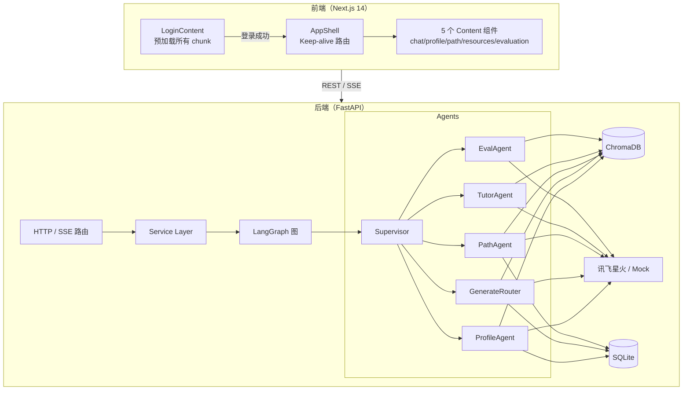

# 学径（LearnPath）系统开发说明书

**项目名称**：学径（LearnPath）— 基于大模型的个性化资源生成与学习多智能体系统  
**赛题**：第十五届中国软件杯 A3  
**版本**：v1.0  
**日期**：2026-05-22

---

## 第 1 章 引言

### 1.1 编写目的

本文档面向评审专家和团队成员，系统说明「学径」的设计思路、技术实现、关键代码与创新点，作为初赛配套开发说明书提交。

### 1.2 项目背景

高等教育学生在自主学习过程中普遍存在以下痛点：

- 学习资源繁杂，难以按个人短板精准筛选；
- 缺乏动态的学习路径指引，依赖线性教材进度；
- 课堂之外的答疑渠道有限，问题积压影响学习连贯性。

学径以**一门完整专业课程**（默认：机器学习导论）为切入点，通过**多智能体协同**与**课程知识库 RAG**，为学生生成可 grounding 的多模态学习资源，并动态规划个性化学习路径。

### 1.3 术语与缩写

| 术语 | 说明 |
|------|------|
| RAG | Retrieval-Augmented Generation，检索增强生成 |
| LangGraph | LangChain 出品的有状态多智能体编排框架 |
| Agent / 节点 | LangGraph 图中的一个处理单元 |
| 学习画像 | 描述学生知识水平、目标、风格等 6+ 维特征的结构化数据 |
| SSE | Server-Sent Events，服务器推送流式文本 |
| Chroma | 开源向量数据库，用于课程知识检索 |
| Keep-alive 路由 | 前端页面首次挂载后永不卸载，切换仅修改 CSS `display` |

### 1.4 参考资料

- 赛题原文：[A3赛题内容.md](../A3赛题内容.md)
- 需求规格：[docs/01-需求规格说明书.md](./01-需求规格说明书.md)
- 开发指南：[docs/02-开发指南.md](./02-开发指南.md)
- 开源协议：[docs/03-开源参考与协议.md](./03-开源参考与协议.md)
- 讯飞星火 HTTP 接口：https://www.xfyun.cn/doc/spark/HTTP调用文档.html
- LangGraph 文档：https://langchain-ai.github.io/langgraph/

---

## 第 2 章 需求分析

### 2.1 目标用户

| 角色 | 核心诉求 |
|------|----------|
| 学生 | 少填表、多对话；资源精准匹配短板；路径清晰可执行 |
| 演示/评审者 | 可复现运行；流程清晰；技术亮点突出 |

### 2.2 核心功能需求

| ID | 功能 | 优先级 |
|----|------|--------|
| FR-01 | 对话式学习画像自动构建（6+ 维，随学随新） | P0 |
| FR-02 | 多智能体协同资源生成（≥5 类：文档/导图/题目/拓展/代码） | P0 |
| FR-03 | 个性化学习路径规划与资源关联 | P0 |
| FR-04 | 智能辅导（RAG 答疑） | P1 |
| FR-05 | 学习效果评估与可视化 | P1 |
| FR-06 | 防幻觉：RAG 引用 + 敏感词过滤 | P0 |

### 2.3 非功能需求

| 类型 | 要求 |
|------|------|
| 响应时间 | SSE 首字符 < 2s（Mock 模式）；正常网络 < 5s |
| 可用性 | 单机本地运行，无需外网（Mock 模式） |
| 可扩展性 | 新增 Agent 仅需实现节点函数并注册到 graph |
| 安全性 | API Key 不入库；敏感词过滤；CORS 白名单 |
| 易用性 | 登录页一键进入（测试时点击即可），无需手动创建账户 |

### 2.4 技术选型理由

| 选型 | 替代方案 | 选择理由 |
|------|----------|----------|
| LangGraph | AutoGen、CrewAI | 图结构可视化调试，状态管理明确，与 LangChain 生态深度集成 |
| ChromaDB | FAISS、Weaviate | 纯 Python，本地持久化零配置，支持关键词回退 |
| 讯飞星火 | GPT-4、文心一言 | 赛题指定，OpenAI 兼容接口便于切换 |
| Next.js | Vite+React、Vue | App Router 原生代码分割，SSR/CSR 灵活切换 |
| SQLite | PostgreSQL | 本地演示零依赖，结构简单，可随项目打包 |

---

## 第 3 章 系统总体设计

### 3.1 总体架构



### 3.2 多智能体协同设计

#### Supervisor 路由策略

Supervisor 通过关键词匹配对用户消息分类：

```
用户消息
 ├─ 含"评估/测验/成绩" → EvalAgent
 ├─ 含"为什么/解释/辅导" → TutorAgent
 ├─ 含"路径/计划/规划" → PathAgent
 ├─ 含"生成/文档/导图/练习" → GenerateRouter → 各 ResourceAgent
 └─ 默认 → ProfileAgent
```

#### GenerateRouter 资源分发

`generate_router_node` 接收 `resource_types` 列表，按类型分发至对应子 Agent（`DocAgent`、`MindmapAgent`、`QuizAgent`、`ReadingAgent`、`MediaAgent`、`CodeAgent`），结果合并写入 `state.resources`。

### 3.3 接口设计

详见第 5 章及 [开发指南 §10](./02-开发指南.md#10-api-契约)。所有接口遵循 RESTful 原则，流式响应采用 SSE（`text/event-stream`）。

---

## 第 4 章 详细设计

### 4.1 对话式学习画像（ProfileAgent）

**流程**：

1. 用户发送自然语言消息，Supervisor 判定 `intent=profile`。
2. `profile_node` 构建 System Prompt，要求 LLM 输出 7 个 JSON 字段。
3. 解析 LLM 输出（正则提取 key:value），填充默认值容错。
4. 调用 `save_profile` 持久化至 `student_profiles` 表。
5. 返回确认文本 + 画像 JSON 写入 `AgentState`。

**画像维度（≥ 6 维，满足赛题要求）**：

| 维度 | 字段 | 更新触发 |
|------|------|----------|
| 知识基础 | `knowledge_level` | 对话 |
| 学习目标 | `learning_goal` | 对话 |
| 认知风格 | `cognitive_style` | 对话 |
| 薄弱知识点 | `error_prone_topics[]` | 对话、练习 |
| 偏好模态 | `preferred_modality` | 对话 |
| 节奏时间 | `pace_and_time` | 对话 |
| 近期进度 | `recent_progress` | 对话、路径 |

### 4.2 多类资源生成

各资源 Agent 共用 `_resource_base.py` 中的 `BaseResourceNode`，提供：

- `_rag_context(topic)` — 从 Chroma 检索课程片段
- `_llm_generate(prompt)` — 调用 LLM 生成内容
- `_save(user_id, type, title, content, extras)` — 持久化到 `learning_resources` 表

**资源类型与输出格式**：

| Agent | 类型键 | 主要输出格式 |
|-------|--------|-------------|
| DocAgent | `doc` | Markdown 讲解文档 |
| MindmapAgent | `mindmap` | Mermaid `mindmap` 语法 |
| QuizAgent | `quiz` | JSON：`[{question, options, answer, explanation}]` |
| ReadingAgent | `reading` | Markdown + 参考链接摘要 |
| MediaAgent | `media` | 图文卡片 + 分镜脚本文本 |
| CodeAgent | `code` | Markdown + Python 代码块 |

### 4.3 学习路径规划（PathAgent）

1. 从 DB 读取当前 `StudentProfile` 与资源列表。
2. 构造 Prompt：要求 LLM 按知识依赖顺序输出 `steps` 列表（标题/目标/关联资源 ID/建议时长）。
3. 解析结果，写入 `learning_paths` 表。

### 4.4 RAG 检索与防幻觉

- 每个生成类 Agent 在调用 LLM 前先检索 `k=5` 个知识片段拼入 System Prompt。
- 生成结果经 `attach_sources` 在末尾添加来源脚注。
- `filter_sensitive` 过滤敏感词后再返回。

### 4.5 前端交互设计

#### 登录页预加载流程

```
用户看到登录页
  → LoginContent 挂载
  → 并行 import() 5 个 Content chunk + ECharts
  → 进度条 = loadedCount / 6
  → 用户点击「开始学习」（320ms 动画后调用 login()）
  → 所有 chunk 基本已下载完毕（约 2-4s）
```

#### 主界面初始化流程

```
login() 触发
  → AppShell 渲染（isLoggedIn = true）
  → 初始化遮罩出现
  → 并行：9 项任务（chunk * 6 + API * 3）
  → 每完成一项 → setInitProgress(done/total * 100)
  → 全部完成 → setInitFading(true) → 380ms 后 setInitDone(true)
  → 遮罩淡出，主界面可交互
```

---

## 第 5 章 接口说明

### 5.1 基础约定

- Base URL：`http://localhost:8000`
- 请求/响应均为 UTF-8 JSON（SSE 为 `text/event-stream`）
- 错误响应：`{"detail": "错误描述"}`，HTTP 4xx/5xx

### 5.2 接口列表

| 方法 | 路径 | 说明 |
|------|------|------|
| GET | `/api/health` | 健康检查 |
| POST | `/api/chat` | 对话（JSON） |
| POST | `/api/chat/stream` | 对话（SSE 流式） |
| GET | `/api/profile/{user_id}` | 获取学习画像 |
| POST | `/api/resources/generate` | 触发多类资源生成 |
| GET | `/api/resources` | 资源列表（`?user_id=&type=`） |
| GET | `/api/path/{user_id}` | 获取学习路径 |
| POST | `/api/path/{user_id}/refresh` | 重新规划路径 |
| POST | `/api/tutor/ask` | 辅导问答 |

详细请求/响应格式见 [开发指南 §10](./02-开发指南.md#10-api-契约) 及 Swagger UI（`http://localhost:8000/docs`）。

---

## 第 6 章 关键代码说明

### 6.1 LangGraph 图构建

```python
# backend/app/agents/graph.py
@lru_cache
def build_graph():
    graph = StateGraph(AgentState)
    graph.add_node("supervisor", supervisor_node)
    graph.add_node("profile",    profile_node)
    graph.add_node("generate",   generate_router_node)
    graph.add_node("path",       path_node)
    graph.add_node("tutor",      tutor_node)
    graph.add_node("eval",       eval_node)
    graph.add_edge(START, "supervisor")
    graph.add_conditional_edges(
        "supervisor", _route_after_supervisor,
        {"profile": "profile", "generate": "generate",
         "path": "path", "tutor": "tutor", "eval": "eval"}
    )
    # 各节点连 END
    return graph.compile()
```

`lru_cache` 确保全进程共享同一编译图，避免重复编译开销。

### 6.2 SSE 流式服务

```python
# backend/app/services/chat_service.py
async def stream_chat(user_id: str, message: str):
    state = build_initial_state(user_id, message)
    result = await build_graph().ainvoke(state)

    reply: str = result.get("reply", "")
    # 模拟逐词流式
    for char in reply:
        yield {"event": "token", "data": char}
        await asyncio.sleep(0.02)

    if result.get("profile"):
        yield {"event": "profile", "data": result["profile"]}
    yield {"event": "done", "data": ""}
```

### 6.3 RAG 检索（回退机制）

```python
# backend/app/rag/retriever.py
async def retrieve(query: str, k: int = 5) -> list[dict]:
    collection = _get_collection()
    if collection and collection.count() > 0:
        # 向量检索路径
        result = collection.query(query_texts=[query], n_results=min(k, collection.count()))
        return [{"id": ids[i], "text": docs[i], ...} ...]

    # 回退：关键词交集打分
    docs = _load_fallback()
    scored = sorted(docs, key=lambda d: len(set(query.split()) & set(d["text"].split())), reverse=True)
    return scored[:k]
```

### 6.4 前端 Keep-alive 路由

```typescript
// frontend/src/components/AppShell.tsx
const mountedRef = useRef<Set<NavRoute>>(new Set([selected]));

useEffect(() => {
  if (!mountedRef.current.has(selected)) {
    mountedRef.current.add(selected);
    setMountedState(new Set(mountedRef.current));
  }
}, [selected]);

// 渲染：已挂载的页面永不销毁，仅切换 display
{NAV_ITEMS.map(({ key, Component }) => {
  if (!mountedState.has(key)) return null;
  return (
    <div key={key} style={{ display: selected === key ? "block" : "none" }}>
      <Component />
    </div>
  );
})}
```

---

## 第 7 章 创新点

### 7.1 对话代替表单的画像构建

传统学情采集依赖冗长问卷，学径通过**一轮自然语言对话**即可提取 7 个维度的结构化画像，降低使用门槛，提升填写完整度。

### 7.2 多智能体分工协同

不同类型资源由专项 Agent 独立负责（DocAgent 专注讲解文档、MindmapAgent 专注导图…），通过 LangGraph 状态图集中编排，各 Agent 可独立测试与迭代，符合单一职责原则。

### 7.3 RAG 双路径防幻觉

检索增强生成 + 关键词回退机制：有 Chroma 向量库时走语义检索，无向量库时降级为关键词匹配，确保演示环境下始终有 grounding 上下文，而非凭空生成。

### 7.4 前端极致性能优化

| 技术 | 效果 |
|------|------|
| 登录页 chunk 预加载 | 用户填写登录信息的同时静默下载所有页面 JS，进入主界面后切换即时 |
| Keep-alive 路由 | 消除页面切换的 React unmount/remount 开销，切换延迟 < 16ms |
| 模块级 ECharts 缓存 | `import("echarts")` 只执行一次，避免重复解析 2MB+ 包 |
| 自定义 webpack chunk | antd / echarts / markdown 各自独立 chunk，并行下载，不阻塞首屏 |

### 7.5 免账号演示模式

登录页预填"演示学生"与"机器学习导论"，评审点击一次「开始学习」即可进入完整功能演示，无需注册或配置账号。

---

## 第 8 章 测试

### 8.1 环境

- Mock 模式（`LLM_MOCK=true`）：无需网络，适合功能验证
- 星火模式（`LLM_MOCK=false`）：接入真实 LLM，验证生成质量

### 8.2 功能测试用例

| 用例 ID | 操作 | 预期结果 |
|---------|------|----------|
| TC-01 | 对话「我是计算机专业，线性回归薄弱」 | 画像页显示 7 维信息，`error_prone_topics` 含"线性回归" |
| TC-02 | 资源页点击「生成新资源」 | 返回 ≥1 类资源，含 `type`、`title`、`content` |
| TC-03 | 路径页点击「重新规划」 | 返回 ≥3 步，每步含标题和描述 |
| TC-04 | SSE 流式对话 | 收到 `token` 事件流，最终 `done` 事件 |
| TC-05 | 退出登录后重新登录 | 重新触发初始化流程，数据刷新 |

### 8.3 性能测试

| 指标 | Mock 模式 | 目标 |
|------|-----------|------|
| 登录页→主界面就绪 | < 3s | < 5s |
| 页面切换延迟 | < 16ms | < 100ms |
| SSE 首字符延迟 | < 500ms | < 2s |

### 8.4 安全测试

- 敏感词：输入含敏感词文本，确认 `filter_sensitive` 过滤后返回
- API Key 泄露：`git log` 确认 `.env` 未入库

---

## 第 9 章 部署说明

### 9.1 本地部署（演示环境）

```
操作系统：Windows 11 / macOS / Ubuntu 22.04
Python：3.11  Node.js：20
服务：后端 localhost:8000，前端 localhost:3000
存储：storage/ 目录（gitignore，含 SQLite + Chroma）
```

启动命令见 [开发指南 §2](./02-开发指南.md#2-快速开始)。

### 9.2 配置检查清单

- [ ] `.env` 中 `LLM_MOCK` 按需设置
- [ ] 知识库已执行 `ingest_kb.py`
- [ ] `frontend/.env.local` 中 `NEXT_PUBLIC_API_BASE` 正确
- [ ] 如前端非 3000 端口，`CORS_ORIGINS` 已更新

---

## 附录 A：文件索引

| 文件 | 说明 |
|------|------|
| `backend/app/agents/graph.py` | LangGraph 图编译入口 |
| `backend/app/agents/supervisor.py` | 意图分类 |
| `backend/app/agents/nodes/` | 各 Agent 实现 |
| `backend/app/rag/retriever.py` | 双路径检索 |
| `backend/app/core/guardrails.py` | 防幻觉工具 |
| `frontend/src/components/LoginContent.tsx` | 登录页 + 预加载 |
| `frontend/src/components/AppShell.tsx` | Keep-alive 路由 + 初始化遮罩 |
| `frontend/src/store/appStore.ts` | 全局状态 |

## 附录 B：AI Coding 工具使用声明

开发过程中使用了 GitHub Copilot（代码补全与架构建议）辅助编写后端 Agent 节点、前端 TypeScript 组件及本文档。核心架构设计与业务逻辑由团队自主完成。


---

## 封面

- 项目名称：学径（LearnPath）
- 赛题：A3 基于大模型的个性化资源生成与学习多智能体系统
- 团队、日期、版本号

---

## 第 1 章 引言

1.1 编写目的  
1.2 项目背景（高等教育个性化学习痛点）  
1.3 术语与缩写（RAG、Agent、画像维度等）  
1.4 参考资料（赛题链接、讯飞文档、本仓库 docs）

---

## 第 2 章 需求分析

2.1 用户需求调研摘要（大学生学习痛点数据/访谈）  
2.2 功能需求（引用 `docs/01-需求规格说明书.md`）  
2.3 非功能需求  
2.4 技术与需求结合点（为何选 LangGraph、RAG、星火）

---

## 第 3 章 系统总体设计

3.1 系统目标与边界  
3.2 总体架构图（见 `docs/diagrams/architecture.mmd`）  
3.3 技术选型说明  
3.4 多智能体协同设计  
   - Supervisor 路由策略  
   - 各 Agent 职责表  
   - 状态图 / 时序图  
3.5 数据设计（ER 图、表结构）  
3.6 接口设计（REST + SSE）

---

## 第 4 章 详细设计

4.1 对话式画像模块（ProfileAgent）  
4.2 资源生成模块（五类 Agent + Reviewer）  
4.3 学习路径与推送模块（PathAgent）  
4.4 智能辅导模块（可选）  
4.5 学习评估模块（可选）  
4.6 防幻觉与安全过滤  
4.7 前端 UI 与交互设计

---

## 第 5 章 实现与集成

5.1 开发环境与工具链  
5.2 讯飞星火集成实现  
5.3 RAG 知识库构建（ml_intro 课程）  
5.4 关键代码说明（附仓库路径）  
5.5 创新点与用户体验优化  
   - 对话建画像 vs 表单  
   - 流式生成进度  
   - 多模态卡片化展示  
   - 对抗式/Reviewer 质检（若实现）

---

## 第 6 章 测试

6.1 测试环境  
6.2 功能测试用例（对照需求验收表）  
6.3 性能与体验测试（响应时间、流式）  
6.4 安全测试（敏感词、幻觉样例）  
6.5 测试结论

---

## 第 7 章 部署与运维

7.1 部署架构（本地 / 云主机）  
7.2 配置说明（.env）  
7.3 启动与停止  
7.4 故障排查

---

## 第 8 章 附录

- 附录 A：API 列表  
- 附录 B：开源与协议（`docs/03`）  
- 附录 C：AI Coding 工具使用说明  
- 附录 D：演示脚本（7 分钟）

---

## 图表清单（待补充）

| 编号 | 名称 | 建议文件 |
|------|------|----------|
| 图 3-1 | 系统总体架构 | docs/diagrams/architecture.mmd |
| 图 3-2 | 多智能体协作时序 | docs/diagrams/agent_sequence.mmd |
| 图 4-1 | 画像更新流程 | docs/diagrams/profile_flow.mmd |
