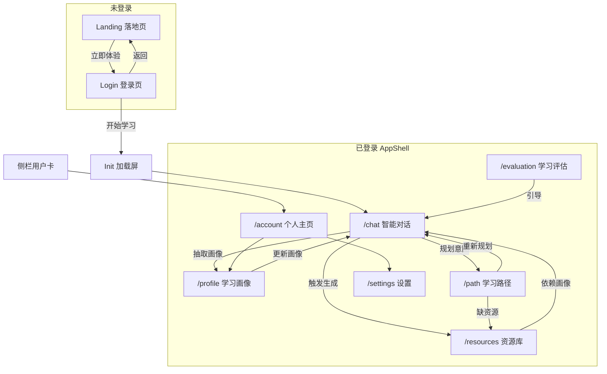

# 学径（LearnPath）界面功能与测试手册

**版本**：v1.0  
**日期**：2026-05-22  
**适用对象**：前端/后端开发、联调、初赛自测与答辩彩排  
**关联文档**：[01-需求规格说明书](./01-需求规格说明书.md) · [02-开发指南](./02-开发指南.md) · [README](../README.md)

---

## 1. 文档目的

本文档回答四类问题，便于后续迭代与验收：

1. **每个界面应实现什么功能**（含赛题对应关系）  
2. **每个界面如何测试功能是否实现**（步骤、预期、API 对照）  
3. **不同页面之间应有什么关系**（数据流、导航、状态）  
4. **页面关联如何测试**（端到端场景、回归清单）

另附：测试环境准备、账号体系、非功能检查项、缺陷记录模板。

---

## 2. 测试环境准备

### 2.1 启动方式

| 方式 | 命令/操作 | 说明 |
|------|-----------|------|
| Windows 一键 | 双击 `打开学径.bat` 或 `.\scripts\start.ps1` | 等待后端 `/api/health` 就绪后打开浏览器 |
| 手动 | 后端 `uvicorn` + 前端 `npm run dev` | 见 [README](../README.md) |
| 知识库 | `python scripts/ingest_kb.py` | 首次或更新 `data/knowledge_base` 后执行 |

### 2.2 前置条件检查

| 检查项 | 预期 |
|--------|------|
| `GET http://localhost:8000/api/health` | HTTP 200 |
| 前端 `http://localhost:3000` | 可打开登录/落地页 |
| `frontend/.env.local` 中 `NEXT_PUBLIC_API_BASE` | **本地联调建议留空**（走 Next 代理 `/api`） |
| `.env` 中 `LLM_MOCK` | `true` 可无星火 Key 完整演示；`false` 需配置 `SPARK_API_KEY` |

### 2.3 测试账号

| 模式 | user_id | 说明 |
|------|---------|------|
| 快速体验 | `demo` | 登录页「快速体验」，可改昵称/课程；账号资料 PATCH 仅内存生效 |
| 邮箱登录 | UUID | 「登录/注册」验证码；数据写入 SQLite `users` 表 |

### 2.4 推荐测试话术（对话页）

```
我是计算机专业大二学生，想系统学习机器学习导论，线性回归和梯度下降比较薄弱，希望偏实践、每周约 8 小时。
```

```
请为我生成线性回归相关的讲解文档和练习题。
```

```
帮我制定一个月的学习计划。
```

---

## 3. 界面总览与赛题映射

```
未登录
  ├── 产品落地页（Landing）
  └── 登录/注册页（Login）
登录后（AppShell + Keep-alive）
  ├── 智能对话      /chat        ← FR-01 画像、FR-02 资源、FR-04 辅导
  ├── 学习画像      /profile     ← FR-01 展示（AI 抽取，非账号资料）
  ├── 学习路径      /path        ← FR-03
  ├── 资源库        /resources   ← FR-02
  ├── 学习评估      /evaluation  ← FR-05（加分）
  ├── 个人主页      /account     ← 产品增强（账号信息）
  └── 设置          /settings    ← 产品增强（主题/语音偏好）
```

| 赛题核心条目 | 主要界面 | 后端能力 |
|--------------|----------|----------|
| 对话式学习画像 ≥6 维 | `/chat` + `/profile` | ProfileAgent、`GET /api/profile/{id}` |
| 多智能体 ≥5 类资源 | `/chat`、`/resources` | Doc/Mindmap/Quiz/Reading/Media/Code Agents |
| 学习路径与推送 | `/path` | PathAgent、`GET/POST /api/path/...` |
| 智能辅导（加分） | `/chat`（答疑意图） | TutorAgent、`POST /api/tutor/ask` |
| 学习效果评估（加分） | `/evaluation` | EvalAgent、`GET /api/eval/{id}` |

---

## 4. 各界面功能说明与测试

### 4.1 产品落地页（Landing）

**路由**：未登录且 `showLanding=true`（默认首页介绍）  
**组件**：`LandingContent.tsx`

#### 应实现功能

| 编号 | 功能 | 优先级 |
|------|------|--------|
| L-01 | 展示产品价值、赛题能力亮点（多智能体、RAG、个性化） | P0 |
| L-02 | 「立即体验」/「登录」进入登录表单（`setShowLanding(false)`） | P0 |
| L-03 | 固定浅色展示，不受已保存深色主题影响 | P1 |

#### 测试步骤

| 步骤 | 操作 | 预期结果 |
|------|------|----------|
| 1 | 未登录访问 `/` 或 `/chat` | 先看到落地页或可从登录页返回落地页 |
| 2 | 点击「立即体验」类按钮 | 进入登录卡片，Tab 为「快速体验」或「登录/注册」 |
| 3 | 在设置中曾选深色主题后退出，再打开落地页 | 落地/登录区仍为浅色表单样式 |

---

### 4.2 登录 / 注册页（Login）

**路由**：未登录且 `showLanding=false`  
**组件**：`LoginContent.tsx`

#### 应实现功能

| 编号 | 功能 | 优先级 |
|------|------|--------|
| A-01 | Tab「快速体验」：姓名、课程选择，提交后 `login()`，`userId=demo` | P0 |
| A-02 | Tab「登录/注册」：邮箱 OTP 发送与验证（`POST /api/auth/send-otp`、`verify-otp`） | P1 |
| A-03 | 登录页预加载主应用 chunk + ECharts（无进度条，登录后由 Init 展示） | P1 |
| A-04 | 「返回介绍页」回到 Landing | P1 |
| A-05 | 后端连接状态不影响登录进入（进入后再在对话页显示离线） | P1 |

#### 测试步骤

| 步骤 | 操作 | 预期结果 |
|------|------|----------|
| 1 | 快速体验 → 填写姓名/课程 →「开始学习」 | 进入初始化加载屏，随后主界面侧栏出现 |
| 2 | 邮箱 Tab → 无效邮箱点发送 | 提示格式错误 |
| 3 | 有效邮箱发送 OTP（Mock 模式） | 响应含 `debug_code` 时界面提示验证码 |
| 4 | 输入 6 位码验证 | 登录成功，`userId` 为后端 UUID，侧栏显示昵称 |
| 5 | 开发者工具 Network | 登录请求走 `/api/auth/*`，无 CORS 错误（代理或直连配置正确） |

#### API 对照

| 接口 | 方法 | 用途 |
|------|------|------|
| `/api/auth/send-otp` | POST | 发送验证码 |
| `/api/auth/verify-otp` | POST | 验证并返回 `AuthUser` |

---

### 4.3 初始化加载屏（Init Loading）

**触发**：登录成功后、`initDone=false` 期间  
**组件**：`InitLoadingScreen.tsx` + `AppShell` 预热逻辑

#### 应实现功能

| 编号 | 功能 | 优先级 |
|------|------|--------|
| I-01 | 展示进度条与步骤文案（对话/画像/路径/资源/评估） | P0 |
| I-02 | 并行：加载 7 个页面模块、拉取 profile/resources/path/eval、预加载 ECharts | P0 |
| I-03 | 逐页短暂「点亮」预热（Keep-alive + ECharts 首次绘制） | P1 |
| I-04 | 完成后淡出，侧栏可点击；超时 20s 强制结束 | P1 |

#### 测试步骤

| 步骤 | 操作 | 预期结果 |
|------|------|----------|
| 1 | 首次登录 | 进度条从 0% 增至 100%，无长时间卡死 |
| 2 | 加载期间点击侧栏 | 菜单不切换（`initDone` 前拦截） |
| 3 | 加载完成后 | 默认在 `/chat`，切换其他页无明显白屏卡顿 |
| 4 | 二次登录（同会话刷新） | 若 store 已有缓存，进度仍合理结束 |

---

### 4.4 智能对话 `/chat`

**组件**：`ChatContent.tsx`  
**赛题**：FR-01 画像构建、FR-02 资源生成触发、FR-04 辅导

#### 应实现功能

| 编号 | 功能 | 优先级 |
|------|------|--------|
| C-01 | 欢迎语 + 快捷操作按钮（构建画像、生成资源、规划路径、知识点答疑） | P0 |
| C-02 | SSE 流式输出（`POST /api/chat/stream`），打字机效果 | P0 |
| C-03 | Markdown 渲染（标题、列表、代码块） | P0 |
| C-04 | 用户/助手气泡区分；**主题切换后**助手气泡随深色变量变化（非死白） | P0 |
| C-05 | 页头显示后端健康状态（在线/未连接/检测中） | P1 |
| C-06 | 对话后刷新画像到全局 store（`getProfile`） | P0 |
| C-07 | 清空对话按钮 | P1 |
| C-08 | 生成资源时展示资源卡片（若 API 返回 resources 元数据） | P1 |

#### 测试步骤

| 步骤 | 操作 | 预期结果 |
|------|------|----------|
| 1 | 进入对话页，观察页头状态 | 后端正常时为「在线」绿点 |
| 2 | 停止后端，15s 内刷新状态 | 变为「后端未连接」 |
| 3 | 发送推荐测试话术 | 流式出现回复，非整段长时间空白 |
| 4 | 发送「生成线性回归学习资源」 | 回复合理；资源库后续可看到新资源（或提示先生成） |
| 5 | 切换设置 → 深色 → 回对话页 | 气泡、输入区、背景与深色主题一致 |
| 6 | 点击「清空对话」 | 仅保留一条清空提示消息 |
| 7 | Network：`/api/chat/stream` | `text/event-stream`，持续收到 token 事件 |

#### API 对照

| 接口 | 说明 |
|------|------|
| `POST /api/chat` | 非流式兜底 |
| `POST /api/chat/stream` | 主路径 SSE |
| `GET /api/health` | 健康检查 |
| `GET /api/profile/{user_id}` | 对话后同步画像 |

---

### 4.5 学习画像 `/profile`

**组件**：`ProfileContent.tsx`  
**说明**：展示 **AI 对话抽取的学情**，与 `/account` 账号资料无关。

#### 应实现功能

| 编号 | 功能 | 优先级 |
|------|------|--------|
| P-01 | 六维（含 recent_progress）雷达图 ECharts | P0 |
| P-02 | 各维度卡片：图标、得分进度条、文字描述 | P0 |
| P-03 | 综合评价段落（由画像字段拼接） | P0 |
| P-04 | 无画像时空状态 + 引导去 `/chat` | P0 |
| P-05 | 「更新画像」跳转对话页 | P0 |

#### 测试步骤

| 步骤 | 操作 | 预期结果 |
|------|------|----------|
| 1 | 新用户未对话直接进入 | Empty + 引导按钮 |
| 2 | 完成对话后再进入 | 雷达图有数据，≥6 个维度有文案 |
| 3 | 在对话中更新薄弱点后再看 | 雷达/卡片数值或文案变化（允许 Mock 固定） |
| 4 | 点击「更新画像」「继续对话优化」 | 无刷新跳转至 `/chat`（clientNavigate） |
| 5 | 深色主题下 | 图表坐标轴、卡片文字可读 |

#### API 对照

| 接口 | 说明 |
|------|------|
| `GET /api/profile/{user_id}` | 返回 `StudentProfile` 七字段 |

**画像字段验收清单**：`knowledge_level`、`learning_goal`、`cognitive_style`、`error_prone_topics`、`preferred_modality`、`pace_and_time`、`recent_progress`。

---

### 4.6 资源库 `/resources`

**组件**：`ResourcesContent.tsx`  
**赛题**：FR-02 多类型资源展示

#### 应实现功能

| 编号 | 功能 | 优先级 |
|------|------|--------|
| R-01 | 列表展示已生成资源（标题、类型标签） | P0 |
| R-02 | 按类型 Tab 筛选（文档/导图/题库/视频脚本/代码/阅读） | P0 |
| R-03 | 关键词搜索 | P1 |
| R-04 | 「生成新资源」：输入主题，调用 `POST /api/resources/generate` | P0 |
| R-05 | 预览弹窗 Markdown/Mermaid 渲染 | P0 |
| R-06 | 收藏（前端本地状态） | P2 |
| R-07 | 与全局 `resources` store 同步 | P0 |

#### 测试步骤

| 步骤 | 操作 | 预期结果 |
|------|------|----------|
| 1 | 无资源时进入 | 空列表或提示，可点击生成 |
| 2 | 生成资源，主题「线性回归」 | Loading → 成功提示，列表新增条目 |
| 3 | 切换各类型 Tab | 筛选正确 |
| 4 | 搜索标题关键字 | 列表过滤 |
| 5 | 预览一条 doc 与一条 mindmap | Markdown 正常；Mermaid 可渲染 |
| 6 | 累计检查类型 | 至少能看到 **5 类** UI 类型映射（与 `resourceConfig` 一致） |

#### API 对照

| 接口 | 说明 |
|------|------|
| `GET /api/resources?user_id=` | 列表 |
| `POST /api/resources/generate` | body: `user_id`, `topic` 等 |

---

### 4.7 学习路径 `/path`

**组件**：`PathContent.tsx`  
**赛题**：FR-03

#### 应实现功能

| 编号 | 功能 | 优先级 |
|------|------|--------|
| T-01 | 展示路径步骤时间线/卡片（标题、目标、时长、状态） | P0 |
| T-02 | 每步关联资源 ID 显示标题（来自资源列表） | P0 |
| T-03 | 总进度条 | P0 |
| T-04 | 「重新规划」调用 `POST /api/path/{id}/refresh` | P0 |
| T-05 | 无路径时空状态 + 引导对话 | P0 |

#### 测试步骤

| 步骤 | 操作 | 预期结果 |
|------|------|----------|
| 1 | 仅有画像、无资源时刷新路径 | 可能提示需先生成资源（按后端逻辑） |
| 2 | 有资源后点击「重新规划」 | 返回 ≥3 步，含 `order/title/objective/resource_ids` |
| 3 | 展开某一步 | 显示关联资源名称 |
| 4 | 步骤状态 | 含 done / in_progress / pending 之一 |
| 5 | 从路径页按钮跳转对话 | 路由到 `/chat` |

#### API 对照

| 接口 | 说明 |
|------|------|
| `GET /api/path/{user_id}` | 获取路径 |
| `POST /api/path/{user_id}/refresh` | 重新生成 |

---

### 4.8 学习评估 `/evaluation`

**组件**：`EvaluationContent.tsx`  
**赛题**：FR-05（加分）

#### 应实现功能

| 编号 | 功能 | 优先级 |
|------|------|--------|
| E-01 | 统计卡片：资源总数、画像完整度、学习天数、是否有路径等 | P1 |
| E-02 | 学习前后雷达对比图 | P1 |
| E-03 | AI 学习建议文案 | P1 |
| E-04 | 近期学习事件时间线 | P1 |
| E-05 | 无数据时引导去对话/资源/路径 | P1 |

#### 测试步骤

| 步骤 | 操作 | 预期结果 |
|------|------|----------|
| 1 | 新用户进入 | 部分指标为 0 或「待生成」，有引导按钮 |
| 2 | 完成对话+资源+路径后进入 | 统计数字增加，雷达 after ≥ before |
| 3 | 点击「前往 AI 助手」 | 跳转 `/chat` |
| 4 | `GET /api/eval/{user_id}` 失败 | 页面错误提示可接受，不白屏 |

---

### 4.9 个人主页 `/account`

**组件**：`AccountContent.tsx`  
**性质**：产品增强，**非**赛题强制页面。

#### 应实现功能

| 编号 | 功能 | 优先级 |
|------|------|--------|
| U-01 | 展示 user_id、邮箱、昵称、课程、专业、简介 | P1 |
| U-02 | 编辑并 `PATCH /api/account/{user_id}` | P1 |
| U-03 | 保存后同步侧栏 `userName`、`courseName` | P1 |
| U-04 | 入口：侧栏用户卡片、菜单「个人主页」 | P1 |
| U-05 | 链接至「学习画像」「设置」 | P2 |

#### 测试步骤

| 步骤 | 操作 | 预期结果 |
|------|------|----------|
| 1 | 点击侧栏底部用户卡片 | 进入 `/account` |
| 2 | demo 用户编辑昵称保存 | 侧栏名称更新；刷新后 demo 恢复默认（内存合并） |
| 3 | 邮箱用户编辑保存 | 刷新仍保留（SQLite） |
| 4 | 点击「查看学习画像」 | 进入 `/profile`，非账号页 |

---

### 4.10 设置 `/settings`

**组件**：`SettingsContent.tsx`  
**性质**：产品增强（主题、语音偏好、流式速度）。

#### 应实现功能

| 编号 | 功能 | 优先级 |
|------|------|--------|
| S-01 | 主题：浅色 / 深色 / 跟随系统，持久化 localStorage | P1 |
| S-02 | 字号、减少动效 | P2 |
| S-03 | TTS 开关与音色（偏好存储，对话 TTS 可后续对接） | P2 |
| S-04 | 流式速度偏好 | P2 |
| S-05 | 恢复默认 | P2 |
| S-06 | 登录页不受深色主题污染（`AuthLightProvider`） | P1 |

#### 测试步骤

| 步骤 | 操作 | 预期结果 |
|------|------|----------|
| 1 | 切换深色 | 主应用侧栏、对话气泡、页头、卡片随主题变化 |
| 2 | 刷新浏览器 | 主题保持 |
| 3 | 退出登录 | 登录页表单为白底样式 |
| 4 | 跟随系统 | 修改 OS 深浅色后页面跟随（需等待或切换窗口） |
| 5 | 恢复默认 | 回到浅色 + 默认字号 |

---

## 5. 页面关系与数据流

### 5.1 导航关系图



### 5.2 全局状态（Zustand `appStore`）

| 字段 | 写入来源 | 读取页面 |
|------|----------|----------|
| `profile` | 对话后 `getProfile`、chat 响应 | profile、eval、path（间接） |
| `resources` | 资源库 load/generate、Init 预取 | resources、path（标题映射） |
| `learningPath` | path 页 load/refresh、Init 预取 | path |
| `evalStats` | Init 预取、evaluation 页 | evaluation |
| `userName` / `courseName` | 登录、account 保存 | 侧栏、account |
| `userId` | 登录 | 所有 API 请求 |

**设置**（`settingsStore`）独立于业务数据，仅影响主题与 UI 偏好。

### 5.3 业务依赖链（必须先后的逻辑）

```
登录 →（可选）对话构建画像 → 生成资源 → 规划/刷新路径 → 评估页有丰富数据
```

| 依赖 | 说明 |
|------|------|
| 画像 → 资源 | 生成接口使用 `user_id` 关联画像上下文 |
| 资源 → 路径 | 路径步骤 `resource_ids` 需引用已存在资源 |
| 行为数据 → 评估 | eval 统计资源数、画像完整度、是否有路径等 |

### 5.4 Keep-alive 与路由

- 七个主路由页面在登录后**同时挂载**，切换仅改 `opacity` + `activeTab`，URL 仍通过 `router.push` 同步。  
- `page.tsx` 返回 `null`，真实 UI 在 `AppShell` 内 `PagePane` 渲染。  
- 测试路由时注意：**以侧栏高亮与内容区为准**，不要仅依赖单独刷新子路径时的 Next 空页面。

---

## 6. 跨页面关联测试（端到端）

### 6.1 场景 E2E-01：赛题主流程（P0，约 15 分钟）

| 序号 | 步骤 | 验证关联 |
|------|------|----------|
| 1 | 快速体验登录 | 进入 Init → Chat |
| 2 | `/chat` 发送画像话术 | — |
| 3 | `/profile` 查看雷达与六维 | **Chat → Profile** 数据一致 |
| 4 | `/resources` 生成「线性回归」资源 | **Profile 上下文 → 资源** |
| 5 | `/path` 重新规划 | **资源 ID → 路径步骤** 可显示标题 |
| 6 | `/evaluation` 查看统计与建议 | **前三步 → Eval** 指标非空 |
| 7 | 侧栏依次切换全部 7 页 | Keep-alive 无白屏、状态保留 |

**通过标准**：无阻塞性报错；画像有内容；资源 ≥1 条；路径 ≥3 步；评估页有数据或合理空态。

---

### 6.2 场景 E2E-02：对话驱动闭环

| 序号 | 步骤 | 验证关联 |
|------|------|----------|
| 1 | 仅在 `/chat` 用自然语言说「帮我生成题库并规划路径」 | Supervisor 路由多 Agent |
| 2 | 不去资源库点击生成，直接看 `/resources` | **对话触发 → 资源列表** 可能增加 |
| 3 | 打开 `/path` | 步骤更新或提示刷新 |
| 4 | 回到 `/chat` 问薄弱点 | **辅导意图** 有 RAG 风格回答（Mock/真实） |

---

### 6.3 场景 E2E-03：账号与画像分离

| 步骤 | 验证 |
|------|------|
| `/account` 修改昵称为「测试 A」 | 侧栏显示「测试 A」 |
| `/profile` 查看 | 仍为 **学情维度**，不因昵称改变雷达 |
| `/account` 点击「查看学习画像」 | 进入 `/profile`，非 account |

---

### 6.4 场景 E2E-04：主题与登录隔离

| 步骤 | 验证 |
|------|------|
| `/settings` 选深色，浏览 chat/profile | 主应用深色一致 |
| 退出登录 | 登录页白卡片 + 浅色输入框 |
| 再次登录 | 仍保持深色主应用 |

---

### 6.5 场景 E2E-05：后端不可用降级

| 步骤 | 验证 |
|------|------|
| 关闭后端登录 | 仍可进入主界面（Init 可能超时结束） |
| `/chat` 发消息 | 助手气泡提示连接失败与启动方式 |
| 启动后端，对话页等待或刷新 | 状态变在线，可正常流式 |

---

## 7. API 与页面对照矩阵

| 页面 | 主要 API | 方法 |
|------|----------|------|
| Login | `/api/auth/send-otp`、`/api/auth/verify-otp` | POST |
| Chat | `/api/chat/stream`、`/api/health`、`/api/profile/{id}` | POST/GET |
| Profile | `/api/profile/{id}` | GET |
| Resources | `/api/resources`、`/api/resources/generate` | GET/POST |
| Path | `/api/path/{id}`、`/api/path/{id}/refresh` | GET/POST |
| Evaluation | `/api/eval/{id}` | GET |
| Account | `/api/account/{id}` | GET/PATCH |
| Settings | —（本地 localStorage） | — |

**辅导独立接口**（可在 Swagger 或 curl 测，对话内为 Agent 路由）：

- `POST /api/tutor/ask` — body: `user_id`, `question`, `topic`

---

## 8. 非功能测试要点

| 类别 | 检查项 | 方法 |
|------|--------|------|
| 流式体验 | 首 token <3s（Mock 可更快） | 对话页计时 |
| 进度反馈 | Init 进度条、资源生成 Loading | 目视 |
| 主题 | 深/浅/系统 + 登录页隔离 | E2E-04 |
| 安全 | 敏感词输入被过滤或拒绝 | 对话发送违规词（见 guardrails） |
| RAG 引用 | 资源/辅导含来源或 chunks | 查看生成 JSON 或 Markdown 脚注 |
| 性能 | 侧栏切换无明显卡顿 | 登录后连续点 7 个菜单 |
| 代理 | `NEXT_PUBLIC_API_BASE` 为空时 `/api` 代理 | Network 看请求 host |

---

## 9. 回归测试清单（发版前勾选）

```
[ ] 打开学径.bat / start.ps1 可启动且 health 200
[ ] 快速体验登录全流程
[ ] 对话流式 + 画像页有数据
[ ] 资源生成 + 预览
[ ] 路径刷新 ≥3 步
[ ] 评估页有统计或空态引导
[ ] 个人主页编辑同步侧栏
[ ] 深色主题 + 登录页浅色
[ ] 七页侧栏切换无空白
[ ] 退出登录回到落地/登录
```

---

## 10. 缺陷记录模板

| 字段 | 说明 |
|------|------|
| ID | 如 BUG-UI-001 |
| 页面 | `/chat` 等 |
| 复现步骤 | 1、2、3… |
| 预期 | 来自本文档第 4 节 |
| 实际 | 截图/录屏 |
| 关联 API | 可选 |
| 优先级 | P0 阻塞赛题 / P1 / P2 |

---

## 11. 修订记录

| 版本 | 日期 | 说明 |
|------|------|------|
| v1.0 | 2026-05-22 | 初版：覆盖 7 个主路由 + 登录/落地/Init；对齐当前代码与赛题 FR |

---

## 12. 相关文件索引（开发定位）

| 页面 | 前端组件 | 路由文件 |
|------|----------|----------|
| Landing | `components/LandingContent.tsx` | —（AppShell 内） |
| Login | `components/LoginContent.tsx` | — |
| Chat | `components/pages/ChatContent.tsx` | `app/chat/page.tsx` |
| Profile | `components/pages/ProfileContent.tsx` | `app/profile/page.tsx` |
| Path | `components/pages/PathContent.tsx` | `app/path/page.tsx` |
| Resources | `components/pages/ResourcesContent.tsx` | `app/resources/page.tsx` |
| Evaluation | `components/pages/EvaluationContent.tsx` | `app/evaluation/page.tsx` |
| Account | `components/pages/AccountContent.tsx` | `app/account/page.tsx` |
| Settings | `components/pages/SettingsContent.tsx` | `app/settings/page.tsx` |
| 壳层 | `components/AppShell.tsx`、`AppSidebar.tsx` | `app/layout.tsx` |

导航常量：`frontend/src/hooks/navRoutes.ts`  
页面模块：`frontend/src/lib/pageModules.ts`
